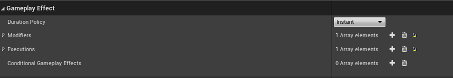
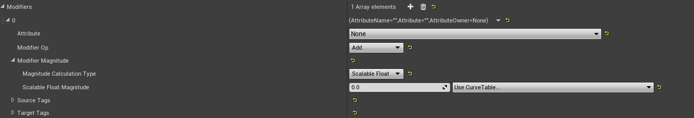
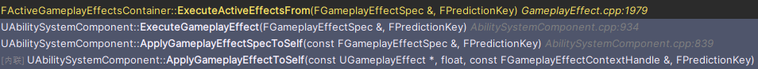
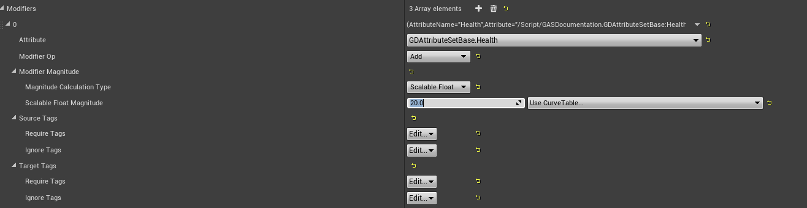

# GAS设计解析三：GE属性修改案例

上一篇章提到 GE 对属性进行修改的两大方式：Modifier 与 Execution。其中 Modifier 又有四种 Magnitude 计算方式。这一偏结合实际项目案例，分别说明它们是如何运作的。



## Modifier

Modifier 这种方式一次只能对一个 Attribute 进行修改，并且需要给定一个修改方式，也就是 ModifierOp。



GE 中保存 Modifier 的成员大致如下：

```cpp
UPROPERTY(EditDefaultsOnly, BlueprintReadOnly, Category = GameplayEffect, meta = (TitleProperty = Attribute))
TArray<FGameplayModifierInfo> Modifiers;
```

`FGameplayModifierInfo` 中最重要的是三个信息：

```cpp
UPROPERTY(EditDefaultsOnly, BlueprintReadOnly, Category = GameplayModifier)
FGameplayAttribute Attribute;

UPROPERTY(EditDefaultsOnly, BlueprintReadOnly, Category = GameplayModifier)
TEnumAsByte<EGameplayModOp::Type> ModifierOp;

UPROPERTY(EditDefaultsOnly, BlueprintReadOnly, Category = GameplayModifier)
FGameplayEffectModifierMagnitude ModifierMagnitude;
```

`Attribute` 决定修改谁，`ModifierOp` 决定怎么修改，`ModifierMagnitude` 决定修改多少。

Magnitude 的定义中包含四种方式：

```cpp
UPROPERTY(EditDefaultsOnly, Category = Magnitude)
TEnumAsByte<EGameplayEffectMagnitudeCalculation::Type> MagnitudeCalculationType;

UPROPERTY(EditDefaultsOnly, Category = Magnitude)
FScalableFloat ScalableFloatMagnitude;

UPROPERTY(EditDefaultsOnly, Category = Magnitude)
FAttributeBasedFloat AttributeBasedMagnitude;

UPROPERTY(EditDefaultsOnly, Category = Magnitude)
FCustomCalculationBasedFloat CustomMagnitude;

UPROPERTY(EditDefaultsOnly, Category = Magnitude)
FSetByCallerFloat SetByCallerMagnitude;
```



实际上，这些方法都是为了拿到一个 float。

可以直接看 `FGameplayEffectModifierMagnitude::AttemptCalculateMagnitude`。它会根据 `MagnitudeCalculationType` 选择不同分支，最终写出 `OutCalculatedMagnitude`：

```cpp
ScalableFloat       -> ScalableFloatMagnitude.GetValueAtLevel()
AttributeBased      -> AttributeBasedMagnitude.CalculateMagnitude()
CustomCalculation   -> CustomMagnitude.CalculateMagnitude()
SetByCaller         -> Spec.GetSetByCallerMagnitude()
```

在 Spec 创建或更新时，计算出来的临时值会存储在：

```cpp
TArray<FModifierSpec> Modifiers;
```

`FModifierSpec` 本身非常朴素，核心就是一个 `EvaluatedMagnitude`。因此 Modifier 的第一步不是直接改属性，只是把“这次要用的数值”算出来。

而真正执行修改时，从下面这条路径进入：

```cpp
FActiveGameplayEffectsContainer::ExecuteActiveEffectsFrom
  FGameplayEffectSpec::GetModifierMagnitude
    GameplayEffectUtilities::ComputeStackedModifierMagnitude
  FActiveGameplayEffectsContainer::InternalExecuteMod
    UAttributeSet::PreGameplayEffectExecute
    UAbilitySystemComponent::ApplyModToAttribute
    UAttributeSet::PostGameplayEffectExecute
```

这里可以看到几个关键点：

1. Modifier 先算出 Magnitude。
2. 如果需要计入 Stack，会通过 `ComputeStackedModifierMagnitude` 处理。
3. 系统把 Attribute、ModifierOp、Magnitude 包成 `FGameplayModifierEvaluatedData`。
4. `InternalExecuteMod` 找到目标 AttributeSet。
5. 执行 `PreGameplayEffectExecute`。
6. 调用 `ApplyModToAttribute` 修改属性。
7. 执行 `PostGameplayEffectExecute`。

这个流程看上去很长，但核心仍然是那句话：算出一个 float，然后按一种操作方式应用到一个 Attribute 上。

### Scalable Float

如图，这个配置代表：当 GE 应用时，对属性 `Health` 加上 20。



假设配置如下：

- Attribute：`Health`
- ModifierOp：`Add`
- Magnitude：`ScalableFloat = 20`
- DurationPolicy：`Instant`

当这个 GE 被应用时，Spec 中对应 Modifier 的 `EvaluatedMagnitude` 就是 20。

执行阶段会生成：

```cpp
FGameplayModifierEvaluatedData EvalData(
	HealthAttribute,
	EGameplayModOp::Additive,
	20.f
);
```

之后进入 `InternalExecuteMod`。对于 Instant GE，它会直接修改 Attribute 的 BaseValue。假设原本 Health 的 BaseValue 是 60，那么这次执行后 BaseValue 变成 80。由于这里没有额外的持续 Modifier 参与当前值计算，CurrentValue 也会跟着变成 80。

如果同样的 Modifier 放在 Duration 或 Infinite GE 里，它通常不会直接把 BaseValue 改掉，而是在 GE 生效期间持续参与属性计算，影响 CurrentValue。GE 移除后，这个 Modifier 不再参与计算，CurrentValue 会按剩余效果重新计算。

所以同样是 `Health +20`：

- Instant GE 直接把BaseValue 修改成 80。
- Duration/Infinite GE 则不直接改动BaseValue，而是提供一个加成，当前显示 80，效果结束后回到原值。

这也是 BaseValue 和 CurrentValue 分开的意义。

#### Stack 下的 Magnitude

如果 GE 有 Stack，并且配置了让 Stack 影响 Modifier Magnitude，系统会调用：

```cpp
GameplayEffectUtilities::ComputeStackedModifierMagnitude(
	BaseComputedMagnitude,
	StackCount,
	ModifierOp
);
```

它的核心思路是先减去该操作的 Bias，再乘以 StackCount，最后加回 Bias。

Add 的 Bias 是 0。比如 `+20` 叠 3 层：

```text
(20 - 0) * 3 + 0 = 60
```

Multiply 和 Divide 的 Bias 是 1。比如 `*1.5` 叠 3 层：

```text
(1.5 - 1) * 3 + 1 = 2.5
```

它不是 `1.5 * 1.5 * 1.5`。如果想要复合乘法，需要使用对应的 Compound Multiply 路径。这里是 GAS 里很容易踩到的地方，代码没有骗你，只是它的数学审美比较直。

Duration 和 Infinite GE 中，多个 Modifier 会按操作类型共同参与 CurrentValue 计算。常见公式可以理解为：

```text
Final = ((Base + Additive) * Multiplicative / Division * CompoundMultiply) + FinalAdd
```

其中 Override 最特殊。只要存在符合条件的 Override Modifier，当前值会直接使用 Override 的值，不再继续套上面的公式。

举个例子：

- Base = 16
- Additive = +20
- Multiplicative = *1.5

结果是：

```text
(16 + 20) * 1.5 = 54
```

如果同时有两个普通 Multiply：`*1.5` 和 `*1.2`，GAS 默认的求和方式不是直接相乘，而是：

```text
1 + (1.5 - 1) + (1.2 - 1) = 1.7
```

所以它们会形成 `*1.7`，不是 `*1.8`。写数值系统时这点要提前和策划说明，否则 Debug 时很容易互相怀疑公式写错了。

### AttributeBased

AttributeBased 的用途是：用某个 Source 或 Target Attribute 来计算本次 Modifier Magnitude。

例如：

- 治疗量 = 施法者法强 * 0.8 + 20
- 伤害 = 攻击者攻击力 - 目标护甲
- 护盾值 = 目标最大生命值 * 0.3

它需要配置一个捕获属性：

- 捕获 Source 还是 Target。
- 捕获哪个 Attribute。
- 是否 Snapshot。
- 使用 BaseValue、Current Magnitude、Bonus Magnitude，还是评估到某个通道。

Snapshot 的意思是：在 Spec 创建时把值固定下来。后续源属性再变，这个 Spec 中的捕获值也不变。

非 Snapshot 则会在需要计算时读取当前值。它更动态，但也更依赖当前 ASC 上的状态。预测时如果客户端和服务端看到的属性不同，结果就可能先预测一个值，随后被服务端纠正。

源码中 `FAttributeBasedFloat::CalculateMagnitude` 的核心公式是：

```text
Result = (Coefficient * (AttribValue + PreMultiplyAdditiveValue)) + PostMultiplyAdditiveValue
```

如果配置了 Curve，还会先用 Curve 对捕获到的属性值做一次映射。

举个例子：

- 捕获 Source 的 `AttackPower`
- AttackPower = 100
- Coefficient = 0.5
- PreMultiplyAdditiveValue = 20
- PostMultiplyAdditiveValue = 10

结果是：

```text
0.5 * (100 + 20) + 10 = 70
```

AttributeBased 适合表达简单、纯数据驱动的公式。如果公式开始需要读取多个属性、判断 Tag、区分暴击、护盾、格挡，就不要硬塞在这里，改用 MMC 或 Execution。

### MMC

MMC 指 `UGameplayModMagnitudeCalculation`，也就是 CustomCalculationClass。

它仍然属于 Modifier 的一种 Magnitude 计算方式。区别在于，这个 float 不再通过配置直接算，而是交给 C++ 或蓝图类：

```cpp
float UMyDamageMMC::CalculateBaseMagnitude_Implementation(
	const FGameplayEffectSpec& Spec) const
{
	// 读取 Spec、Captured Attribute、SetByCaller、Tag，然后返回一个 float
	return Damage;
}
```

MMC 可以：

- 捕获 Source 或 Target Attribute。
- 读取 Source/Target Tag。
- 读取 `FGameplayEffectContext`。
- 读取 SetByCaller 传入的运行时值。
- 根据 GE Level 做计算。

但它最终只能返回一个 float。因此 MMC 仍然适合“算一个 Modifier 的值”，不适合“一次修改多个属性”。

MMC 可以被预测，前提是这次 GE 本身在有效预测窗口里应用，并且 MMC 使用的数据在客户端也可靠可得。如果 MMC 读取了只有服务端知道的数据，客户端当然无法算出同一个结果。预测不能凭空补齐不存在的数据。

一个常见写法是：

```cpp
const float ChargeTime = Spec.GetSetByCallerMagnitude(
	TAG_Data_ChargeTime,
	false,
	0.f
);

float AttackPower = 0.f;
GetCapturedAttributeMagnitude(AttackPowerDef, Spec, EvaluationParameters, AttackPower);

return AttackPower * FMath::Clamp(ChargeTime, 0.f, 2.f);
```

这里 SetByCaller 提供运行时蓄力时间，Captured Attribute 提供角色属性，MMC 负责把它们组合成一个最终数值。

### SetByCaller

SetByCaller 表示这个 Magnitude 不在 GE 资产中写死，而是在运行时写入 Spec。

例如：

```cpp
FGameplayEffectSpecHandle SpecHandle = ASC->MakeOutgoingSpec(
	DamageEffectClass,
	AbilityLevel,
	EffectContext
);

SpecHandle.Data->SetSetByCallerMagnitude(
	TAG_Data_Damage,
	FinalDamage
);

ASC->ApplyGameplayEffectSpecToTarget(*SpecHandle.Data.Get(), TargetASC);
```

GE 中的 Modifier 配置使用同一个 GameplayTag 作为 Key，就可以从 Spec 中取到 `FinalDamage`。

SetByCaller 适合这些情况：

- 蓄力技能，根据按住时间决定伤害。
- 投射物命中后，根据飞行距离决定伤害。
- 技能外部已经算好伤害，只需要交给 GE 应用。
- 同一个 GE 资产被多个 Ability 复用，每次传入不同数值。

## Execution

Execution 指 `UGameplayEffectExecutionCalculation`。它和 MMC 最大的不同是：MMC 返回一个 float，Execution 可以输出多个属性修改。

典型入口如下：

```cpp
void UMyDamageExecution::Execute_Implementation(
	const FGameplayEffectCustomExecutionParameters& ExecutionParams,
	FGameplayEffectCustomExecutionOutput& OutExecutionOutput) const
{
	// 读取 Source/Target Attribute、Tag、SetByCaller、Context
	// 计算伤害、护盾扣减、生命扣减等

	OutExecutionOutput.AddOutputModifier(
		FGameplayModifierEvaluatedData(
			HealthAttribute,
			EGameplayModOp::Additive,
			-DamageToHealth
		)
	);
}
```

Execution 可以做这些事：

- 读取多个 Source/Target Attribute。
- 根据 Source/Target Tag 修正公式。
- 使用 SetByCaller 作为输入。
- 根据 EffectContext 读取命中结果、伤害来源、物理材质等项目自定义数据。
- 输出多个 `FGameplayModifierEvaluatedData`。
- 触发 Conditional GameplayEffect。
- 手动声明 GameplayCue 或 StackCount 是否已经处理。

例如一个伤害结算：

1. 读取 SetByCaller 中的基础伤害。
2. 捕获攻击者的 AttackPower。
3. 捕获目标的 Armor、Shield、DamageReduction。
4. 根据 Tag 判断是否暴击、是否格挡、是否无敌。
5. 先扣 Shield，再扣 Health。
6. 输出两个 Modifier：`Shield -X`、`Health -Y`。

这种逻辑用 Modifier 和 MMC 也许能绕出来，但会很别扭。Execution 就是为这类服务端结算准备的，但代价是Execution 不能被预测。源码和文档都很明确：ExecutionCalculation 不走客户端预测。原因也很直接，它可以做的事情太多，输入来源也太复杂，客户端不一定拥有同样数据。最终结果应当由服务端计算，再同步给客户端。

## 一次属性修改的完整路径

把上面的内容串起来，一个 Instant GE 修改属性的大致路径是：

```text
ASC ApplyGameplayEffectSpecToSelf
  -> 检查权限、Tag、概率、免疫、自定义要求
  -> Spec.CalculateModifierMagnitudes
  -> ActiveGameplayEffects.ExecuteActiveEffectsFrom
      -> 遍历 Modifiers
      -> 计算/读取 EvaluatedMagnitude
      -> 处理 Stack Magnitude
      -> 生成 FGameplayModifierEvaluatedData
      -> InternalExecuteMod
          -> 找到 AttributeSet
          -> PreGameplayEffectExecute
          -> ApplyModToAttribute
          -> PostGameplayEffectExecute
```

Duration 和 Infinite GE 的路径略有不同。它们会进入 ActiveGameplayEffects，里面的 Modifier 在 GE 生效期间持续参与对应 Attribute 的 CurrentValue 计算。GE 被移除时，这些 Modifier 不再参与计算，CurrentValue 会根据剩余效果重新计算。

Periodic GE 则介于两者之间：它本身是 Duration 或 Infinite，但每次周期触发时，会像 Instant 一样执行一遍 Modifier/Execution。

## 最佳食用指南

面对一个 GE 属性修改时，可以先把它分成三档来看。

Modifier 是最常见、最通用的一档。它的模型很简单：修改一个 Attribute，选择一种 ModifierOp，再算出一个 Magnitude。固定治疗、固定消耗、简单 Buff、基于表格成长的数值，通常都应该优先考虑 Modifier。它的好处是清晰、数据化、容易预测，也更容易和 Stack、Tag Requirement、持续时间这些 GE 机制配合。

MMC 可以理解为“带一定自定义能力的 Modifier”。它仍然属于 Modifier 路线，最终也只是返回一个 float，但这个 float 可以交给 C++ 或蓝图类计算。当 ScalableFloat、AttributeBased、SetByCaller 这些配置项不够表达公式时，可以用 MMC。它适合“公式复杂了一点，但最终还是只想得到一个数”的场景。

Execution 是能力最强、也最灵活的一档。它可以读取更多上下文，做更完整的服务端结算，也可以一次输出多个属性修改。复杂伤害、护盾优先扣减、护甲减伤、暴击格挡、生命偷取这类逻辑，通常更适合 Execution。但它的代价也很明确：ExecutionCalculation 不支持预测，结果应该由服务端计算后同步给客户端。

所以粗略地说：

- 常见、简单、可预测的属性修改，优先 Modifier。
- 需要自定义公式，但最后只产出一个数，用 MMC。
- 需要复杂结算、多个输出或强服务端裁决，用 Execution。

至于 GE 的持续类型，则是另一个维度：一次性结算选 Instant，临时状态选 Duration 或 Infinite，周期跳伤害或回血选 Periodic。


## 本章结论

GE 修改属性的核心是：先得到 Magnitude，再通过 ModifierOp 应用到 Attribute。

ScalableFloat 适合固定值和表驱动数值。AttributeBased 适合基于单个属性的简单公式。MMC 适合计算一个较复杂的 Magnitude。SetByCaller 适合运行时传值。Execution 适合服务端复杂结算和多属性输出。

适合断点观察的位置：

- `FGameplayEffectSpec::CalculateModifierMagnitudes`
- `FGameplayEffectModifierMagnitude::AttemptCalculateMagnitude`
- `FAttributeBasedFloat::CalculateMagnitude`
- `FCustomCalculationBasedFloat::CalculateMagnitude`
- `FGameplayEffectSpec::SetSetByCallerMagnitude`
- `FActiveGameplayEffectsContainer::ExecuteActiveEffectsFrom`
- `FActiveGameplayEffectsContainer::InternalExecuteMod`
- `GameplayEffectUtilities::ComputeStackedModifierMagnitude`
