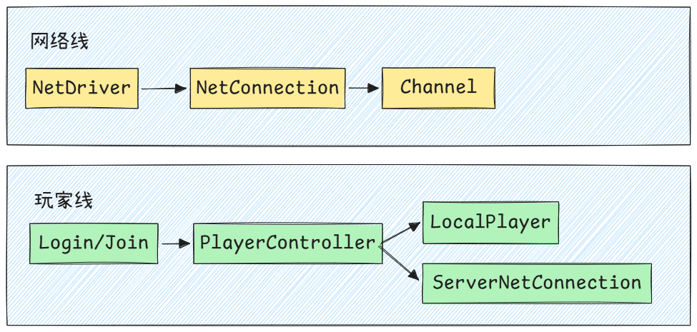
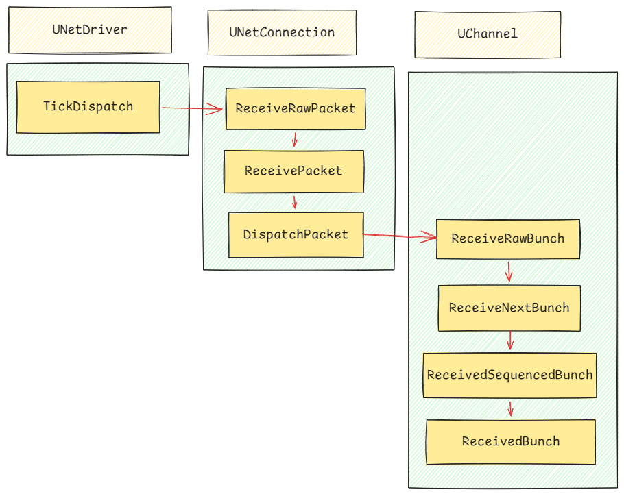
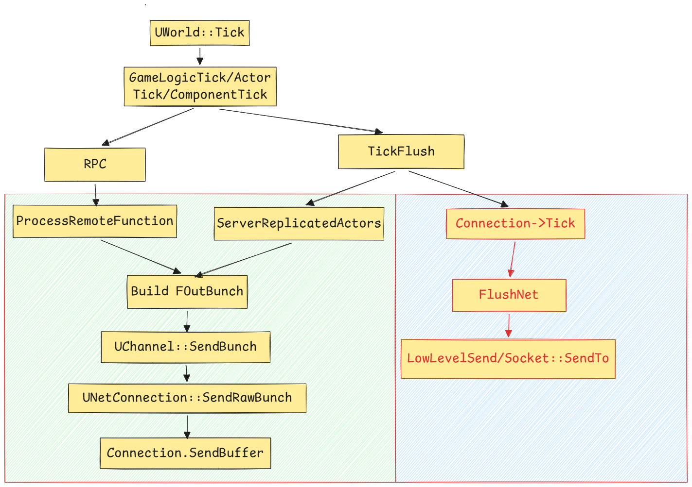

# UE网络笔记一：网络总览

这篇笔记内容并不会过多涉及到实际工程中的用法，也不会提到UE最新的网络复制系统Iris，更多希望解析以Replicate和RPC的为模型的UE网络概览，理清数据处理和流向。

## 前置知识

一个程序如果想和另一台机器上的程序通信，就需要通过Socekt进行发送和接收数据。网络通信一般解决三个问题：发给哪个机器、发给哪个程序，用什么方式发。Socket就是程序进行收发数据的通信端点，常见的TCP和UDP，就是通过Socket使用的。UE最底层使用的UDP，作为传输层协议，它的通信方式更像是，把数据往对应IP地址的端口一塞，它的核心特征是无连接、不保证送达，不保证顺序，也不自动重传，换来的是其开销和延迟的便利。UE会在这个基础上构建自己所需的可靠协议。关于TCP和UDP的内容，上过网络课的应该都比较了解，不再赘述了。

如果游戏引擎给予UDP做网络同步，势必要在这此基础上封装一层自己的机制，例如、加上数据包序号、给某些需要保证到达的消息增加确认机制、对丢包内容选择性重发、控制发包频率、包括在网络波动的情况下调整发送的策略，决定同步的对象等等。因为UDP只是一个很快的传输层工具，需要补全大量面对游戏场景的机制。

## 概念说明

UE网络运行的中心类可以分两条线理解。



### `NetDriver`

`UWorld`是游戏世界的顶层运行容器了，无论是服务器还是客户端，都有自己的world。从网络的角度看，地图里的`Actor`/`Level`/`GameMode`/`GameState`等等，则是需要进行同步的对象，因此`UWorld`可以认为是提供网络复制发生的上下文。而`NetDriver`就绑定在`World`中。

```jsx
bool UWorld::Listen( FURL& InURL )
{
	...
	// Create net Driver
	if (GEngine->CreateNamedNetDriver(this, NAME_GameNetDriver, NAME_GameNetDriver))
	{
		NetDriver = GEngine->FindNamedNetDriver(this, NAME_GameNetDriver);
		NetDriver->SetWorld(this);
		// ...
	}
	// ...
}
```

`NetDriver`是挂在 `World` 网络上下文下的网络驱动器。

它负责驱动网络信息的收发、管理连接、管理Actor复制的调度、以及维护网络相关的状态。

在服务器视角下，服务器上的`NetDriver`会管理多个客户端连接，它维护了一组`ClientConnection`

在客户端视角下，客户端上的NetDriver则管理到服务器的连接。

```jsx
	/** Array of connections to clients (this net driver is a host) - unsorted, and ordering changes depending on actor replication */
	UPROPERTY()
	TArray<TObjectPtr<UNetConnection>> ClientConnections;
	
	/** Connection to the server (this net driver is a client) */
	UPROPERTY()
	TObjectPtr<class UNetConnection> ServerConnection;
```

### `NetConnection`

`NetConnection`的生命周期主要由`NetDriver`和连接状态主导。

简单来说

- 服务器端，每个远端客户端连接进来时，`Server NetDriver` 创建一个 `ClientConnection`。
- 客户端端，主动连接服务器时，`Client NetDriver` 创建一个 `ServerConnection`。
- `Connection` 创建之后先通过 `ControlChannel` 完成握手和登录流程；登录成功后，服务器才创建对应的 `PlayerController`，并将 `PlayerController` 与该 `Connection` 绑定。

`NetConnection`管理连接基本的事情。例如Packet收发、ACK/丢包/重传、可靠/不可靠数据处理、Channel集合等。

### `Channel`

`Channel`应该理解为建立`NetConnection`上的逻辑数据通道。既然已经建立了一条网络连接，其收发到的数据应该被处理并发送给其他消费数据的对象方，而承载这些分发数据流的载体就是`Channel`。

常见的Channel包含：

- `ControlChannel`：连接控制、登录、握手、Travel 等
- `ActorChannel`：Actor 复制、RPC、Actor 创建销毁
- `VoiceChannel`：语音

其生命周期有NetConnection和具体网络业务决定，连接存在期间，会按需打开Channel、业务结束或者连接关闭时，则会关闭Channel。

这里再额外解释一下**`ActorChannel`** , 这是最常见和最重要的Channel类型。服务器要把某个 Actor 同步给某个客户端时，通常会在该客户端的 `NetConnection` 上创建或复用对应的 `ActorChannel`。

`ActorChannel`一定是某个`Connection`针对某个Actor的专用通道。举个可能的例子

```cpp
服务器上有 Actor_A。

Client_1 能看到 Actor_A：
    ServerConnection_1 上有 Actor_A 对应的 ActorChannel。

Client_2 也能看到 Actor_A：
    ServerConnection_2 上也有 Actor_A 对应的 ActorChannel。
```

也就是说，一个服务器 Actor 可以对应多个 `ActorChannel`。每个 `ActorChannel` 属于不同的 `Connection`。

### `LocalPlayer/ServerConnection`

见上图，为什么这里要单独拿出来提这两个呢，因为这里是一个比较容易混淆的地方。

`UPlayer` 是一个玩家来源抽象。它的子类包含ULocalPlayer、UNetConnection。

`APlayerController` 中有 `Player` 概念，表示这个控制器的玩家来源，见源码

```cpp
	/** UPlayer associated with this PlayerController.  
		Could be a local player or a net connection. */
	UPROPERTY()
	TObjectPtr<UPlayer> Player;
```

- 对于客户端本地玩家通常是

```cpp
PlayerController->Player = LocalPlayer
```

`ULocalPlayer` 是本地玩家对象，表示当前进程中的一个本地玩家输入源和视口。

它不是网络连接，也不是服务器上的远端玩家对象。

- 而对于服务器的远端玩家则通常是

```cpp
PlayerController->Player = NetConnection
```

`UNetConnection` 一方面是网络连接对象，另一方面在服务器远端玩家场景下，又可以作为 `PlayerController` 的 `Player` 来源。

## 数据收包流程

一条完整的收包主线如下，如果调试过RPC函数，这个堆栈应该会非常熟悉，接下来这一节内容会结合源码，拆解收包流程。



### `UIpNetDriver::TickDispatch`

IpNetDriver作为NetDriver的子类，是实际业务的承载者。`UIpNetDriver::TickDispatch` 是传统 UDP 路径的每帧收包入口

```jsx
UWorld::Tick
  -> BroadcastTickDispatch
    -> UNetDriver::TickDispatch
      -> UIpNetDriver::TickDispatch
```

它最核心的职责是从socket或者接受队列中取packet，然后按地址找到连接。

```jsx
void UIpNetDriver::TickDispatch(float DeltaTime)
{
	Super::TickDispatch(DeltaTime);
	// ...
	for(FPacketIterator It(this); It ; ++It)
	{
      FReceivedPacketView ReceivedPacket;
      bool bOk = It.GetCurrentPacket(ReceivedPacket); // 取Packet
      TSharedRef<const FInternetAddr> FromAddr = ReceivedPacket.Address.ToSharedRef();

      UNetConnection* Connection = nullptr;
      UIpConnection* MyServerConnection = GetServerConnection();
      
      // ...
      
      // 客户端: 找到服务器的Connection
	    if(MyServerConnection)
	    {
          if (MyServerConnection->RemoteAddr->CompareEndpoints(*FromAddr))
          {
              Connection = MyServerConnection;
          }
	    }
	    
	    // 服务器：从Packet地址匹配ClientConnection,找到对应的客户端Connection
      if (Connection == nullptr)
      {
					if (TObjectPtr<UNetConnection>* ConnectionMapValue = MappedClientConnections.Find(FromAddr))
          {
             Connection = *ConnectionMapValue;
          }
      }

      if (Connection == nullptr)
      {
	       // 处理未关联NetConnection的数据包，执行握手重建connection或者是映射
          Connection = ProcessConnectionlessPacket(ReceivedPacket, It.GetWorkingBuffer());
      }

      if (Connection != nullptr && ReceivedPacket.DataView.NumBytes() > 0)
      {
          Connection->ReceivedRawPacket(
              (uint8*)ReceivedPacket.DataView.GetData(),
              ReceivedPacket.DataView.NumBytes());
      }
	}
}

```

简单来说，NetDriver

- 客户端通常只有 `ServerConnection`，只接受远端地址匹配服务器的 packet。
- 服务器通过 `MappedClientConnections` 按来源地址找到某个客户端连接。
- 找不到连接时才会进入 `ProcessConnectionlessPacket`，处理握手、challenge、无连接控制包。
- 只有拿到 `UNetConnection`，普通 packet 才进入 `ReceivedRawPacket`。

### `UNetConnection::ReceivedRawPacket`

Connection在这里对原始数据进行一些处理，主要交给PacketHandle进行处理，负责对握手、加密校验等等、Handel这里有可能直接消费掉这个包数据，不再往下传了。它处理完毕后的数据会进入到ReceivePacket进行下一步处理

```cpp
void UNetConnection::ReceivedRawPacket( void* InData, int32 Count )
{
	 // ...
    uint8* Data = (uint8*)InData;

    if (Handler.IsValid())
    {
        FReceivedPacketView PacketView;
        PacketView.DataView = { Data, Count, ECountUnits::Bytes };

				// 进入Handler的处理链路
        EIncomingResult Result = Handler->Incoming(PacketView);

				// 如果处理后依然有数据的话，继续下发
        Count = PacketView.DataView.NumBytes();
        
        if (Count == 0)
        {
            return;
        }
        
        Data = PacketView.DataView.GetMutableData();
    }

    FBitReader Reader(Data, Count * 8);
    ReceivedPacket(Reader, false, true);
}
```

### **`ReceivedPacket::ReceivedPacket`**

这一层接手的数据通过了Raw层处理，可以按UE网络协议进行解析了。

1. 它会解析当前收到的`PacketHander`，更新本端接受侧的`InPacketId`，包括一些丢包统计和顺序状态。
2. 然后处理`ACK/NAK`的逻辑。这里的 `ACK / NAK` 指向的是本端之前发出去的 packet，因此会触发 `ReceivedAck` / `ReceivedNak`，进而更新本端的可靠性状态
3. 之后，才是调用`DispatchPacket` ，把`Packet`中剩余的数据继续下发处理
4. 最后，还会根据处理结果，记录对当前`Packet`的接受结果，等待之后发送给对端

### **`ReceivedPacket::DispatchPacket`**

`DispatchPacket`会开始处理Packet中的Channel数据，一个Packet可以包含多个Bunch。

简单来说

1. 从数据流中读出 bunch header 和 payload，构建`FInBunch` 
2. 通过 `ChIndex / ChName` 找到或创建 channel
3. 把 `FInBunch` 交给 `Channel->ReceivedRawBunch`

这里依然不会取解释Actor的属性或者是执行RPC，具体的语义依然要由Channel自身来决定

```cpp
void UNetConnection::DispatchPacket(
    FBitReader& Reader,
    int32 PacketId,
    bool& bOutSkipAck,
    bool& bOutHasBunchErrors)
{
		// ...
    while (!Reader.AtEnd() && GetConnectionState() != USOCK_Closed)
    {
	    // 构建InBunch
        FInBunch Bunch(this);
        uint8 bControl = Reader.ReadBit();
        Bunch.PacketId = PacketId;
        Bunch.bOpen = bControl ? Reader.ReadBit() : 0;
        Bunch.bClose = bControl ? Reader.ReadBit() : 0;
        Bunch.bReliable = Reader.ReadBit();

        uint32 ChIndex = 0;
        Reader.SerializeIntPacked(ChIndex);
				// ...
        UChannel* Channel = Channels[Bunch.ChIndex];

				// 从 Packet里取出当前Bunch的payload,挂给FInBunch
        int32 BunchDataBits = Reader.ReadInt(UNetConnection::MaxPacket * 8);
        Bunch.ResetData(Reader, BunchDataBits, AlignTo32Bits(BunchDataBits));

				// ..
        if (Channel == nullptr)
        {
	        //..
	        // 如果没有找到能够处理的Bunch的Channel，在这里创建出来
            Channel = CreateChannelByName(
                Bunch.ChName,
                EChannelCreateFlags::None,
                Bunch.ChIndex);
        }

				// 发给Channel处理Bunch
        if (Channel)
        {
            Channel->ReceivedRawBunch(Bunch, bLocalSkipAck);
        }
    }
}
```

### `UChannal::ReceivedRawBunch`

packet 层顺序和 channel 层 reliable 顺序是两套东西。`ReceivedPacket` 处理 packet id；`ReceivedRawBunch` 会对接受的Bunch进行一些顺序处理。

```jsx
void UChannel::ReceivedRawBunch(FInBunch& Bunch, bool& bOutSkipAck)
{
    if (Bunch.bHasPackageMapExports)
    {
        PackageMap->ReceiveNetGUIDBunch(Bunch);
    }

    if (Bunch.bReliable &&
        Bunch.ChSequence != Connection->InReliable[ChIndex] + 1)
    {
	    
		    // 找到该Bunch应该插入的等待链表位置，把Bunch塞进去
	      FInBunch** InPtr;
				for( InPtr=&InRec; *InPtr; InPtr=&(*InPtr)->Next )
				{
						if( Bunch.ChSequence==(*InPtr)->ChSequence )
						{
							// Already queued.
							return;
						}
						else if( Bunch.ChSequence<(*InPtr)->ChSequence )
						{
							// Stick before this one.
							break;
						}
				}
		
				FInBunch* New = new FInBunch(Bunch);
				New->Next     = *InPtr;
				*InPtr        = New;
				NumInRec++;
				
				
				// ...
    }
    else
    {
			    // bDeleted意味着处理这个Bunch的过程中，当前Channel被关闭或者清理
				  // 所以如果bDeleted为真,应该返回避免操作此Channel
					bool bDeleted = ReceivedNextBunch( Bunch, bOutSkipAck );
			
					if (bDeleted)
					{
						return;
					}
						
			    while (InRec)
			    {
				    if(InRec->ChSequence != Connection->InReliable[ChIndex] + 1)
					    break;
					    
			        FInBunch* Release = InRec;
			        InRec = InRec->Next;
			        NumInRec--;
			        Release->Next = nullptr;
			
			        bDeleted = ReceivedNextBunch( *Release, bLocalSkipAck );
			        // ...
			        
			        delete Release;
			    }
    }

}
```

- 这段逻辑的核心操作在于，Reliable Bunch 必须按 Channel 内的可靠序号严格顺序处理；非 Reliable Bunch 可以直接处理。如果当前接受到的Reliable Bunch乱序，会插入到`InRec`中 。`InRec`本质是已经收到，但暂时不能处理的Reliable Bunch队列。它缓存乱序到达的Reliable Bunch，等缺失的Reliable Bunch到达后，再按顺序释放处理。
- 另一个问题是：什么情况下Bunch会被标记为Reliable呢？简单来说，网络层要求必须到达，且按顺序处理的Channel数据包，都会被标记为Reliable Bunch。例如Reliable的RPC，除此之外，像是连接握手、加载地图、NetGUID等控制信息、一些可靠传输的ActorChannel数据，都有可能通过Reliable Bunch发送，所以说，Reliable RPC 是 Reliable Bunch 的典型来源，但 Reliable Bunch 不只来自 RPC。

### `UChannel::ReceivedNextBunch`

简单来说，**`ReceivedNextBunch`** 会处理Partical Bunch的拼接，拼接完整后再交给具体的Channel。

```cpp
bool UChannel::ReceivedNextBunch(FInBunch& Bunch, bool& bOutSkipAck)
{
    // 1. 可靠 Bunch：更新本通道收到的可靠序号
    if (Bunch.bReliable)
    {
        check(Bunch.ChSequence == Connection->InReliable[Bunch.ChIndex] + 1);
        Connection->InReliable[Bunch.ChIndex] = Bunch.ChSequence;
    }
		
		FInBunch* HandleBunch = &Bunch;
    // 2. 如果是分片 Bunch，需要先重组
    if (Bunch.bPartial)
    {
	    // 分片重做逻辑...
    }
    
    // 通道打开等校验状态...
    
    // 最终交给真正的有序 Bunch 处理逻辑
    return ReceivedSequencedBunch(*HandleBunch);
}
```

Bunch可以理解为Channel上的一段逻辑消息，一个逻辑消息可能太大，超过单次发送的允许或者是单个Bunch的大小限制，所以有时候一个大的Bunch会被拆成多个partial bunch进行发送，这也是为什么在接收端这里需把这些片段再拼接起来。而到了**`ReceivedSequencedBunch`**  这一层，它拿到的则是按顺序重组的完整Bunch，进行真正的处理逻辑。

### **`UChannel::ReceivedSequencedBunch`**

`ReceivedSequencedBunch` 的主线非常短

```cpp
bool UChannel::ReceivedSequencedBunch(FInBunch& Bunch)
{
    if (!Closing)
    {
        ReceivedBunch(Bunch);
    }

    if (Bunch.bClose)
    {
        ConditionalCleanUp(false, Bunch.CloseReason);
        return true;
    }

    return false;
}
```

ReceivedBunch是一个虚函数，不同的Channel在这里处理各自的业务语义。例如

- UControllChannel：连接控制消息
- UActorChannel：Actor创建/属性复制/RPC等
- UVoiceChannel：语言数据

## 数据发包流程

数据发送流程可以从服务端和客户端两方视角里来看。客户端和服务器都会发包，但是它们发出的东西不完全一样，除了RPC外，服务端还承担了把自己权威Actor状态复制给各个客户端。



这里可以分成两个阶段，一个是收集Bunch的阶段，此帧中游戏逻辑产生的FOutBunch，通过各自`UChannel::SendBunch`，最终写入名为`SendBuffer`的缓存中，在这里等候后续发包

```cpp
class UNetConnection : public UPlayer
{

public:
	// Packet.
	FBitWriter		SendBuffer;						// Queued up bits waiting to send
}
```

另一个则是发送阶段，见`UNetDriver::TickFlush`。这是每帧出站的主要入口，最终通过`FlushNet` 发包

### `UNetDriver::TickFlush`

```jsx
void UNetDriver::TickFlush(float DeltaSeconds)
{
    ...

    if (IsServer() && ClientConnections.Num() > 0)
    {
         ServerReplicateActors(DeltaSeconds);   
    }
    
    if (ServerConnection)
    {
        ProcessLocalClientPackets();
        ServerConnection->Tick(DeltaSeconds);
    }
    else
    {
        ProcessLocalServerPackets();
    }

    for (UNetConnection* Connection : ClientConnections)
    {
        Connection->Tick(DeltaSeconds);
    }
}
```

这段代码把服务端和客户端的差异分得很清楚。

- 服务端有 `ClientConnections`，会在传统复制路径中执行 `ServerReplicateActors`，产生 Actor 复制数据，然后逐个 `ClientConnection->Tick`，把连接上的待发送数据通过`FlushNet`发包。
- 客户端通常有 `ServerConnection`，客户端不需要走复制Actor，因为它并非权威端。客户端本地业务产生的上行数据，通常已经在游戏逻辑阶段写到了 `ServerConnection.SendBuffer`，后续由 `ServerConnection->Tick` ，把连接上的待发送数据通过`FlushNet`发包

```jsx
void UNetConnection::Tick(float DeltaSeconds)
{
    ...

    if (TimeSensitive ||
        (Driver->GetElapsedTime() - LastSendTime) > Driver->KeepAliveTime)
    {
				bool bHandlerHandshakeComplete = !Handler.IsValid() || Handler->IsFullyInitialized();
		
				// Delay any packet sends on the server, until we've verified that a packet has been received from the client.
				if (bHandlerHandshakeComplete && HasReceivedClientPacket())
				{
					FlushNet();
				}
    }
}
```

### RPC

RPC远程过程调用，它并不是直接调用远端函数，而是会先序列化成`FOutBunch` ，走`ActorChannel`的通道发送

```jsx
void UNetDriver::ProcessRemoteFunctionForChannelPrivate(...)
{
    if (Ch->OpenPacketId.First == INDEX_NONE)
    {
		    // ...

        if (!bIsServer)
        {
            return;
        }

        Ch->SetForcedSerializeFromRPC(true);
        Ch->ReplicateActor();
        Ch->SetForcedSerializeFromRPC(false);
    }

    FOutBunch Bunch(Ch, 0);

    if (Function->FunctionFlags & FUNC_NetReliable)
    {
        Bunch.bReliable = 1;
    }

    FNetBitWriter TempWriter(...);
    RepLayout->SendPropertiesForRPC(Function, Ch, TempWriter, Parms);

    ...

    if (QueueBunch)
    {
        Ch->QueueRemoteFunctionBunch(TargetObj, Function, Bunch);
    }
    else
    {
        Ch->SendBunch(&Bunch, true);
    }
}
```

这里简单体积两个细节。

1. RPC参数通过`RepLayout->SendPropertiesForRPC` 序列化，写入函数标识和参数。
2. 如果`ActorChannel` 没初始化打开，客户端一侧直接return。因为客户端不能在服务器还没有建立连接的时候就发RPC，而如果是服务器发给客户端，服务器会先强制`ReplicateActor()` ,让客户端认识这个Actor，再调用其上的RPC。

### Actor复制

传统的复制路径入口（这里写传统的意思就是非IRis的复制系统）是`ServerReplicateActors` 

```jsx
int32 UNetDriver::ServerReplicateActors(float DeltaSeconds)
{
    if (ClientConnections.Num() == 0)
    {
        return 0;
    }

    if (ReplicationDriver)
    {
        return ReplicationDriver->ServerReplicateActors(DeltaSeconds);
    }

    ReplicationFrame++;

    const int32 NumClientsToTick =
        ServerReplicateActors_PrepConnections(DeltaSeconds);

    if (NumClientsToTick == 0)
    {
        return 0;
    }

    ServerReplicateActors_BuildConsiderList(CurrentConsiderList, ServerTickTime);

    for (UNetConnection* Connection : ClientConnections)
    {
        if (Connection->ViewTarget)
        {
            ServerReplicateActors_ForConnection(Params);
        }
    }
}
```

我们知道服务器并不是把所有的Actor广播给所有客户端，它会先构建本帧值得考虑的 Actor 列表，再针对每条连接去判断相关性、优先级、level 可见性等等。

看`UNetDriver::ServerReplicateActors_ProcessPrioritizedActorsRange` ，这里是真正进入某个Actor进行写出的位置。

```jsx
int32 UNetDriver::ServerReplicateActors_ProcessPrioritizedActorsRange(...)
{
	if (!Connection->IsNetReady())
	{
	    return 0;
	}

	for (...)
	{
	    UActorChannel* Channel = PriorityActors[j]->Channel;
	    AActor* Actor = ActorInfo->Actor;
	
	    const bool bLevelInitializedForActor =
	        IsLevelInitializedForActor(Actor, Connection);
	
	    if (bIsRecentlyRelevant)
	    {
	        if (Channel == nullptr && bLevelInitializedForActor)
	        {
	            **Channel = (UActorChannel*)Connection->CreateChannelByName(
	                NAME_Actor,EChannelCreateFlags::OpenedLocally);**
	
	            if (Channel)
	            {
	                Channel->SetChannelActor(Actor, ESetChannelActorFlags::None);
	            }
	        }
	
	        if (Channel && Channel->IsNetReady())
	        {
	            Channel->ReplicateActor();
	        }
	    }
	
	    if ((!bIsRecentlyRelevant || Actor->GetTearOff()) && Channel != nullptr)
	    {
	        Channel->Close(EChannelCloseReason::Relevancy);
	    }
	}
}
```

对于服务器来说，`ActorChannel` 一定是隶属于某个Connection的。而一个Connection会关联一个客户端。也就是说，同一个服务端 Actor，如果要复制给三个客户端，就可能分别在三个 `ClientConnection` 上有三个 `ActorChannel`。

### **`UActorChannel::ReplicateActor`**

在这里，服务器的Actor复制会写入`FOutBunch`

```jsx
int64 UActorChannel::ReplicateActor()
{
    ...

    FOutBunch Bunch(this, 0);

    if (RepFlags.bNetInitial && OpenedLocally)
    {
        Connection->PackageMap->SerializeNewActor(
            Bunch,
            this,
            static_cast<AActor*&>(Actor));
    }

    if (!bIsNewlyReplicationPaused)
    {
        bWroteSomethingImportant |=
            ActorReplicator->ReplicateProperties(Bunch, RepFlags);

        bWroteSomethingImportant |=
            DoSubObjectReplication(Bunch, RepFlags);

        bWroteSomethingImportant |=
            UpdateDeletedSubObjects(Bunch);
    }

    if (bWroteSomethingImportant)
    {
        FPacketIdRange PacketRange = SendBunch(&Bunch, 1);
        ...
    }
}
```

初始复制时，`SerializeNewActor` 会写入远端创建或绑定这个 Actor 所需的信息。后续属性变化由 `FObjectReplicator / FRepLayout` 写入。

### **`UChannel::SendBunch`**

我们上文一直说到`FOutBunch`，这是和收包侧的`FInBunch`对应的。可以理解为携带相关Channel连接信息的数据流。

这些连接信息最主要包括

- `ChIndex` / `ChName`：这段数据属于哪条 channel。
- `bReliable`：是否需要可靠、有序、可重发。
- `bOpen` / `bClose`：是否打开或关闭 channel。
- `bPartial`：是否是一个大 bunch 拆出来的分片。
- `bHasPackageMapExports` / `bHasMustBeMappedGUIDs`：是否携带对象引用导出相关信息。

后续 `UNetConnection::SendRawBunch` 会把这些信息写成 bunch header。收包侧的 `DispatchPacket` 再根据这些 header 还原出 `FInBunch`，找到对应的 channel。

```jsx
FPacketIdRange UChannel::SendBunch(FOutBunch* Bunch, bool Merge)
{
    ...

    if (OpenedLocally && OpenPacketId.First == INDEX_NONE)
    {
        Bunch->bOpen = 1;
    }

    TArray<FOutBunch*>& OutgoingBunches = Connection->GetOutgoingBunches();
    OutgoingBunches.Reset();
   
    // ... 总之在这里构建Bunch所需的写入内容

    if (Bunch->GetNumBits() > MAX_SINGLE_BUNCH_SIZE_BITS)
    {
        // split into partial bunches
        ...
    }
    else
    {
        OutgoingBunches.Add(Bunch);
    }

    for (FOutBunch* NextBunch : OutgoingBunches)
    {
        NextBunch->bReliable = Bunch->bReliable;
        NextBunch->bOpen = Bunch->bOpen;
        NextBunch->bClose = Bunch->bClose;
        NextBunch->ChIndex = Bunch->ChIndex;
        NextBunch->ChName = Bunch->ChName;

        FOutBunch* ThisOutBunch = PrepBunch(NextBunch, OutBunch, Merge);
        int32 PacketId = SendRawBunch(ThisOutBunch, Merge, ...);
        ...
    }
}
```

`Reliable RPC` 通常会让 `Bunch.bReliable = true`，于是进入 channel 的可靠队列，等待 ack/nak 后移除或重发。

普通属性复制更偏状态同步，如果丢了一次更新，后续复制仍然会基于其他机制进行追赶，让客户端追赶到服务端认为需要同步的状态，它关心的是客户端最终拿到足够新的状态，而不是每个中间变化都逐条可靠送达。某些 Actor 复制数据在初始打开等场景下可能被打进 reliable bunch，但这只能说明特定 bunch 走了可靠传输，不代表“属性复制整体就是 reliable”。

简单来说：Reliable RPC 保证的是“调用这条消息到达”，属性复制追求的是“状态最终同步到位”。

### 关于`SendBuffer`

可以理解为`SendBuffer` 是 `UNetConnection` 上的出站 packet 组装缓冲区。

```jsx
// NetConnection.h
FBitWriter SendBuffer; // Queued up bits waiting to send
```

只有等到`FlushNet`时，`SendBuffer`里面的内容才会被当成一个packet交给`LowLevelSend`。

### **`UNetConnection::FlushNet`**

在这里是连接层提交Packet的位置，这里面对的数据已经是组装好的Packet内容了。

```jsx
void UNetConnection::FlushNet(bool bIgnoreSimulation)
{
    ValidateSendBuffer();
    LastEnd = FBitWriterMark();
    TimeSensitive = 0;

    if (SendBuffer.GetNumBits() ||
        HasDirtyAcks ||
        Driver->GetElapsedTime() - LastSendTime > Driver->KeepAliveTime)
    {
        FOutPacketTraits Traits;

        if (SendBuffer.GetNumBits() == 0)
        {
            WriteBitsToSendBuffer(NULL, 0);
            Traits.bIsKeepAlive = true;
        }

        if (Handler.IsValid())
        {
            Handler->OutgoingHigh(SendBuffer);
        }

        SendBuffer.WriteBit(1);

        if (!IsInternalAck())
        {
            WritePacketHeader(SendBuffer);
            WriteFinalPacketInfo(SendBuffer, PacketSentTimeInS);
        }

        if (Driver->IsNetResourceValid())
        {
            LowLevelSend(SendBuffer.GetData(), SendBuffer.GetNumBits(), Traits);
        }

        PacketNotify.CommitAndIncrementOutSeq();
        ++OutPacketId;

        LastSendTime = Driver->GetElapsedTime();
        InitSendBuffer();
    }
}
```

- `FlushNet` 不要求一定有业务 bunch。只要存在 dirty ack，或者 keepalive 到时间，也可能发出 packet。
- `FlushNet` 最后调用的是虚函数 `LowLevelSend`。传统 UDP 路径下会进入 `UIpConnection` ，到这里已经编码成字节流，`FScoket::SendTo`不会关心是Actor复制还是RPC，只负责把数据发给远端地址了

```jsx

void UIpConnection::LowLevelSend(void* Data, int32 CountBits, FOutPacketTraits& Traits)
{
    uint8* DataToSend = static_cast<uint8*>(Data);

    if (!RemoteAddr.IsValid() || !RemoteAddr->IsValid())
    {
        return;
    }

    SendToRemote(DataToSend, CountBits, Traits);
}

void UIpConnection::SendToRemote(uint8* DataToSend, int32 CountBits, FOutPacketTraits& Traits)
{
    if (Handler.IsValid() && !Handler->GetRawSend())
    {
        const ProcessedPacket ProcessedData =
            Handler->Outgoing(DataToSend, CountBits, Traits);

        DataToSend = ProcessedData.Data;
        CountBits = ProcessedData.CountBits;
    }

    int32 CountBytes = FMath::DivideAndRoundUp(CountBits, 8);
    FSocket* CurSocket = GetSocket();

    CurSocket->SendTo(
        DataToSend,
        CountBytes,
        BytesSent,
        *RemoteAddr);
}

```

## 其他

- 问题一：`TickDispatch`会通过`FPacketIterator`每帧取多少个入站packet
  
    并不是每帧固定取多少个包，如果发送的包很少会尽快处理。如果包很多，会根据容量和预算决定。整体上遵循在本帧尽力把可处理的packet推进到下个流程
    
- 问题二：网络包到达机器是异步的，包先来了还没消费怎么办
  
    会有SocketBuffer。如果由开启receive thread，它负责读取后塞给游戏线程的包队列，等待消费。如果没有，游戏线程直接从socket取包。
    
- 怎么表达网络同步中一个跨端对象，怎么认出来是哪个Actor的
  
    不是内存地址，UE用NetGUID来标识，它是网络层发给某个Actor的唯一编号。
    
- 同一个Packet中，客户端先处理属性，还是RPC
  
    通常按Bunch在Packet里的顺序处理。因此不要用“同包内属性一定先于 RPC”或“RPC 一定先于属性”作为逻辑前提。
    

尽管借助了AI梳理，不过本文依然保持了古法写作。在AI时代，阅读源码变成一件极其没有门槛的事情，AI近乎量子速读的能力，能快速厘清源码内容，抓住主要脉络，真的非常方便了。大部分草稿散落在自己的笔记中，有点犹豫有没有写的必要，不过工作间隙梳理成文，把内容内化到脑子里，依然要花费必须的时间，也算帮助消化吸收了。
