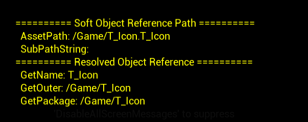
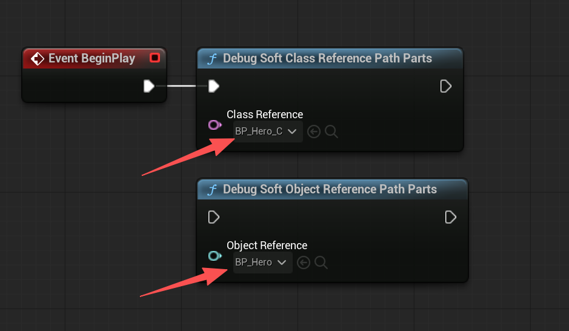
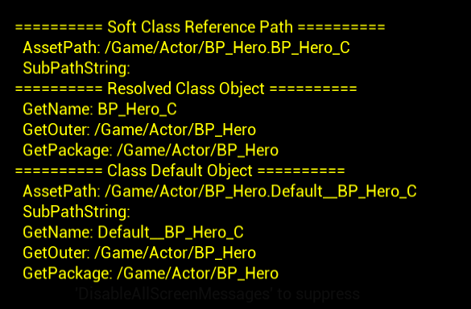
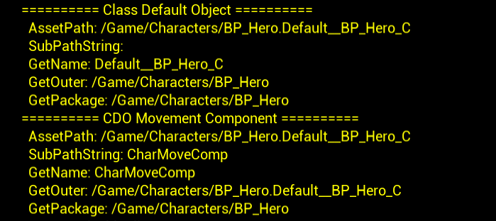

# UE资产管理笔记上：资产，加载及数据表

资产相关的系列内容，是日常经常打交道，但可能都没有系统对待或整理过。然而如果没有良好处置项目中的资产，一定会慢慢导致项目的腐坏，甚至会有严重的性能问题。之前处理过一些资产清理的业务，但缺乏深入探究，正好借助这个机会整理一下，这篇笔记内容可能写的比较发散冗长，但尽可能详细的解释遇到的概念。


## 什么是资产

UE里的资源引用粗略的分为两类，也就是硬引用和软引用。

* 硬引用是在属性里直接保存UObject/UClass的引用，加载拥有者时，目标资源也会进入依赖链
* 软引用则是在属性中保存资源路径，加载拥有者时，只拿到路径而不自动加载目标资源

那么软引用这里保存的路径是什么呢？它并非只是单纯的路径字符串，而是应该被各种系统共同理解的对象地址。首先，在资产管理这个语境下，大部分可被加载、引用和保存到内容目录里的资产，都是UObject或其派生对象。例如材质、贴图、DA和DT等都是UObject或其派生对象，而资产管理讨论的资产，通常就是指的保存在磁盘package里的顶层UObject。

package 更像是 UObject 系统里的“外层容器”和保存单元。`UPackage` 自己也是一个 `UObject` 派生类型。一个普通的资产对象最终会属于某个Package。我们看这段代码

```c++
UPackage* UObjectBaseUtility::GetPackage() const
{
	const UObject* Top = static_cast<const UObject*>(this);
	for (;;)
	{
		// GetExternalPackage will return itself if called on a UPackage
		if (UPackage* Package = Top->GetExternalPackage())
		{
			return Package;
		}
		Top = Top->GetOuter();
	}
}
```

每个UObject都可以有一个Outer，表示“这个对象属于谁/放在哪个对象里面”。如果一个对象是资产里的子对象，它的Outer可能就是这个资产对象，如果本身就是顶层对象了，那么它的Outer通常就是UPackage。

```
/**
 * Returns true iff the Asset is a TopLevelAsset (not a subobject, its outer is a UPackage).
 * Only TopLevelAssets can be PrimaryAssets in the AssetManager.
 * A TopLevelAsset is not necessarily the main asset in a package; see IsUAsset.
 */
COREUOBJECT_API bool IsTopLevelAsset() const;

bool FAssetData::IsTopLevelAsset(UObject* Object)
{
	if (!Object)
	{
		return false;
	}
	UObject* Outer = Object->GetOuter();
	if (!Outer)
	{
		return false;
	}
	return Outer->IsA<UPackage>();
}
```

我们实际调试验证一下。假如在Content目录下有一个名叫T_Icon的贴图文件`Content/T_Icon.uasset`，当它被加载到内存中后，引擎会创建或填充一个UPackage对象（也是一个UObject），它里面会包含真正的类型为UTexture2D资产对象，也就是T_Icon，

```c++
UTexture2D* Texture = ...;

Texture->GetName(); 
Texture->GetClass(); 
Texture->GetOuter();
Texture->GetPackage(); 
```

调试打印一下内容：



长包名通常表示为`/Game/T_Icon`，这个`/Game`可以理解为项目Content目录对应的挂载点。所以package name描述的是这个资源包在UE虚拟资源路径系统里的位置。

```tex
Package: /Game/T_Icon
Asset:   T_Icon
```

那么package + asset name 合起来，就得到了常见的object path

```cpp
/Game/T_Icon.T_Icon
```

蓝图会比较特殊，假如我们有个资产是`/Content/Actor/BP_Hero.uassset`。加载到内存后，这个Package对象里会存在蓝图资产本体和编译后`UBlueprintGeneratedClass`对象。可以通过`TSoftObjectPtr<UObject>`和`TSoftClassPtr<UObject>`直观看到。`TSoftClassPtr<UObject>`指向的是这个蓝图编译类对象，也就是蓝图对应的`UClass`，会带上一个_C的小尾巴，这是蓝图生成类的命名约定。



这个UClass对应的信息是这样的，正常运行时也会通过这个UClass生成出实际的游戏对象，也打印一下这个蓝图类的CDO对象信息，可以看到也在一个Package里，这说明这个Package并非只包含了一个Object对象，在我们这里例子里，它就包含了BP_Hero、BP_Hero_C、Default__BP_Hero_C。



还有一种情况则是子对象路径，也就是说，某些对象并非是package里的顶层资产，而是资产内部的子对象。或者说，子对象的关键是这个UObject的Outer是另一个UObject。我们上文打印路径里看到的这个SubPathString，就是留给子对象用的。

最常见的子对象是下面两个例子

* 默认子对象：类默认对象 CDO 上的子对象模板。C++ 类通常在构造函数里通过 `CreateDefaultSubobject` 声明这些默认子对象，例如 `ACharacter` 的 `CapsuleComponent`、`CharacterMovement`、`Mesh`；Blueprint 在 Components 面板里添加的组件，也会进入蓝图生成类的默认结构。实例化 Actor 时，运行时 Actor 会根据这些默认模板创建或初始化自己的组件实例。
* 运行时动态子对象：游戏运行中通过 `NewObject<>()` 创建，并把 Outer 指向某个 UObject 的对象。例如 `NewObject<UMyComponent>(Actor)` 创建出来的组件，如果 Outer 是这个 Actor，它就是这个 Actor 的子对象。但它不是默认子对象，因为它不是 CDO 上的类模板。

还是以上文BP_Hero这个例子，我们可以打印一下它的CDO对象里的Movement子对象



一般以：连接

```
/Game/Characters/BP_Hero:Default__BP_Hero_C.CharMoveComp
```


## 路径、引用以及AssetRegistry

我们知道UE对指向某个对象，一般分为硬引用或者软引用，例如`TObjectPtr<T>`,`TSoftObjectPtr<T>`这样的形式。对于软引用而言，一般会表达为路径。

### FSoftObjectPath

FSoftObjectPath包含FTopLevelAssetPath AssetPath和FUtf8String SubPathString，是描述路径的底层结构。

```C++
struct FSoftObjectPath
{
private:
	/** Asset path, path to a top level object in a package. This is /package/path.assetname */
	UPROPERTY()
	FTopLevelAssetPath AssetPath;

	/** Optional FString for subobject within an asset. This is the sub path after the : */
	UPROPERTY()
	FUtf8String SubPathString;
    
}
```

* `FTopLevelAssetPath AssetPath`：顶层资产路径

* `FUtf8String SubPathString`：可选子对象路径，也就是 `:` 后面的部分。

可以调用`FSoftObjectPath::TryLoad`触发加载。

### TSoftObjectPtr

`FSoftObjectPtr` 是带缓存能力的软指针，`TSoftObjectPtr<T>` 是它的模板包装，方便写在 `UPROPERTY` 里并约束类型。

```c++
// Engine/Source/Runtime/CoreUObject/Public/UObject/SoftObjectPtr.h
/**
 * FSoftObjectPtr is a type of weak pointer to a UObject, that also keeps track of the path to the object on disk.
 * It will change back and forth between being Valid and Pending as the referenced object loads or unloads.
 * It has no impact on if the object is garbage collected or not.
 *
 * This is useful to specify assets that you may want to asynchronously load on demand.
 */
struct FSoftObjectPtr : public TPersistentObjectPtr<FSoftObjectPath>
{
    UObject* LoadSynchronous() const
    {
        UObject* Asset = Get();
        if (Asset == nullptr && !IsNull())
        {
            ToSoftObjectPath().TryLoad();
            Asset = Get();
        }
        return Asset;
    }
};

template<class TObjectID>
struct TPersistentObjectPtr
{
private:
	/** Once the object has been noticed to be loaded, this is set to the object weak pointer **/
	mutable FWeakObjectPtr	WeakPtr;
	/** Guid for the object this pointer points to or will point to. **/
	TObjectID				ObjectID;
}

/**
 * TSoftObjectPtr is templatized wrapper of the generic FSoftObjectPtr,
 * it can be used in UProperties
 */
template<class T=UObject>
struct TSoftObjectPtr
{
    FSoftObjectPtr SoftObjectPtr;
};
```

举个例子，一个`TSoftObjectPtr<UTexture2D>  Icon` 并不是一个已经加载的贴图指针，而是一个能解析到某个贴图的路径，加上一份弱缓存。

如果对象没加载时，它无法解析到，只有一个路径，是pending状态。

```C++
/**  
 * Test if this does not point to a live UObject, but may in the future
 * 
 * @return true if this does not point to a real object, but could possibly
 */
UE_FORCEINLINE_HINT bool IsPending() const
{
    return Get() == nullptr && ObjectID.IsValid();
}

/**  
 * Test if this points to a live UObject
 *
 * @return true if Get() would return a valid non-null pointer
 */
UE_FORCEINLINE_HINT bool IsValid() const
{
    return !!Get();
}
```

如果对象加载了，可以直接通过`Get()`获取到引用，但是软引用并不保活，这个对象依然有可能被GC掉。

### TSoftClassPtr

也是软引用，但是最终它期望解析成被约束为T的子类的`UClass`，和`TSoftObjectPtr`干的事上面差不多。

### AssetRegistry 

AssetRegistry是UE负责维护资产元数据和磁盘包里记录的依赖关系的角色，具体来说，它负责解释某个路径下有那些资产，某个包依赖哪些包，哪些包引用了这个包。

最重要的两个接口依赖查询接口如下

```C++
/**
 * Gets a list of AssetIdentifiers or FAssetDependencies that are referenced by the supplied AssetIdentifier.
 * Only returns dependencies reported in the on-disk package.
 */
virtual bool GetDependencies(FName PackageName, TArray<FName>& OutDependencies, ... ) const = 0;

/**
 * Gets a list of AssetIdentifiers or FAssetDependencies that reference the supplied AssetIdentifier.
 * Only returns referencers reported in the on-disk package.
 */
virtual bool GetReferencers(FName PackageName, TArray<FName>& OutReferencers, ... ) const = 0;
```

这里要注意，它查询的是on-disk package里记录的依赖，而不是运行时，它管理的是索引和引用图，并非UObject。编辑器下经常用的`Reference Viewer`，基本上就是 AssetRegistry 依赖/引用图能力的编辑器可视化入口。

这里提到一个概念叫资产元数据，也就是`AssetData`，它是一个轻量资产描述，保存了资产的包名、路径、资产名等等信息，并不是一个已加载的UObject。通过`FAssetData::GetSoftObjectPath()`生成`FSoftObjectPath `

```C++
struct FAssetData
{
	/** The name of the package in which the asset is found, this is the full long package name such as /Game/Path/Package */
	FName PackageName;

	/** The path to the package in which the asset is found, this is /Game/Path with the Package stripped off */
	FName PackagePath;

	/** The name of the asset without the package */
    FName AssetName;

	/** The path of the asset's class, e.g. /Script/Engine.StaticMesh */
	FTopLevelAssetPath AssetClassPath;

    //...
};
```


## 加载以及StreamableManager

### `LoadObject`

加载系统负责把路径变成对象。最直接的同步加载，例如模板函数 `LoadObject<T>` ，其实是`StaticLoadObject`的包装

```C++
COREUOBJECT_API UObject* StaticLoadObject(
    UClass* Class,
    UObject* InOuter,
    FStringView Name,
    FStringView Filename = {},
    uint32 LoadFlags = LOAD_None,
    UPackageMap* Sandbox = nullptr,
    bool bAllowObjectReconciliation = true,
    const FLinkerInstancingContext* InstancingContext = nullptr);

template< class T >
inline T* LoadObject(UObject* Outer, FStringView Name, ...)
{
    return (T*)StaticLoadObject(T::StaticClass(), Outer, Name, ...);
}
```

使用上很简单：

```
UTexture2D* Icon = LoadObject<UTexture2D>(
    nullptr,
    TEXT("/Game/UI/T_Icon_Sword.T_Icon_Sword"));
```

`TSoftObjectPtr::LoadSynchronous()` 也是同步加载，它最终会走到 `FSoftObjectPath::TryLoad()`，同步加载会阻塞发起调用的线程，直到加载流程完成。如果这个调用发生在 GameThread，并且加载耗时较长，就会表现为游戏/编辑器卡顿。

### `FStreamableManager`

FStreamableManager 管理的是 streaming assets 的加载请求、回调、句柄和保活。经常用作软引用加载，因为它的公开接口主要就是接收`FSoftObjectPath` / `TSoftObjectPtr` / `TSoftClassPtr` 这类路径目标。

```C
/**
 * A native class for managing streaming assets in and keeping them in memory.
 * AssetManager is the global singleton version of this with blueprint access
 */
struct FStreamableManager : public FGCObject
```

常用的异步加载可能这样写，底层调用的是LoadPackageAsync这样的异步加载接口。

```C++
FStreamableManager& Streamable = UAssetManager::GetStreamableManager();
TSharedPtr<FStreamableHandle> Handle = Streamable.RequestAsyncLoad(
    IconPath,
    FStreamableDelegate::CreateLambda([IconPath]()
    {
        UObject* LoadedObject = IconPath.ResolveObject();
        UTexture2D* Texture = Cast<UTexture2D>(LoadedObject);
        //...
    }));
```

`FStreamableHandle` 不只是回调句柄。只要 Handle 处于 Active 状态，加载出来的资产就会留在内存里。

```c++
/** A handle to a synchronous or async load. As long as the handle is Active, loaded assets will stay in memory */
struct FStreamableHandle : public TSharedFromThis<FStreamableHandle>
{
    void ReleaseHandle();
    void CancelHandle();
};
```

FStreamableManager也提供了同步加载接口，相比于直接同步加载，StreamableManager提供了一些加载管理。

```c++
/**
 * Synchronously load a set of assets, and return a handle. 
 * This can be very slow and may stall the game thread for several seconds.
 */
TSharedPtr<FStreamableHandle> RequestSyncLoad(...);

/**
 * Synchronously load the referred asset and return the loaded object.
 * This can be very slow and may stall the game thread for several seconds.
 */
UObject* LoadSynchronous(...);
```

`FStreamableManager` 的同步加载通常是“发起加载请求，然后阻塞等待结果”。如果这个阻塞发生在 GameThread，并且目标资产大、依赖链长，或者触发了较重的 IO、反序列化、资源初始化，就可能造成明显卡顿。

可以看出，在游戏业务这一层，只要面对的是资产路径，一些需要考虑生命周期管理的场景下，都优先考虑使用FStreamableManager，只有在一些诸如编译器工具，小资源，或者不被玩家感知的路径上触发的加载，可以考虑直接使用LoadObject这类直接使用的同步接口。


## 数据表

### `DataTable`

#### 成员设计

一个典型的DT行数据定义可能是这样的

```cpp
USTRUCT()
struct FItemRow : public FTableRowBase
{
    GENERATED_BODY()

    UPROPERTY()
    int32 Id;

    UPROPERTY()
    FText Name;
};
```

`DataTable`可以看两个关键成员

```cpp
UCLASS(...)
class UDataTable
{
    UPROPERTY(VisibleAnywhere, Category=DataTable, meta=(DisplayThumbnail="false"))	
    TObjectPtr<UScriptStruct>   RowStruct;
protected:
	/** Map of name of row to row data structure. */
	TMap<FName, uint8*>		RowMap;
};
```

- `RowStruct`对应的就是`FItemRow`此用户自定义结构体的反射数据。描述了这行数据字段有哪些、类型是什么等等。
- `RowMap` 是行名到行数据内存的映射。

平时调用可能是这样的

```cpp
const FItemRow* Row = DataTable->FindRow<FItemRow>(RowName, TEXT("Find"));
```

这里本质用 `FName` 在 `RowMap` 里找到那行数据，再按 `FItemRow` 解释。

```cpp
template <class T>
T* FindRow(FName RowName,const TCHAR* ContextString,bool bWarnIfRowMissing = true) const
{

    //...

    uint8* const* RowDataPtr = GetRowMap().Find(RowName);
    if (RowDataPtr == nullptr)
    {
         return nullptr;
    }

    uint8* RowData = *RowDataPtr;
    check(RowData);

    return reinterpret_cast<T*>(RowData); // 转型
}
```

`uint8*` 在这里也就是表示”指向一块原始字节内存“。对应的是某一行自定义数据的内存地址

当此表格被加载时，会反序列化成`UDataTable`对象，这里`RowStruct`标注了`UPROPERTY`参与默认 UObject 序列化，但`RowMap` 因为是 `TMap<FName, uint8*>` 原始内存，不能靠默认反射系统自动处理，因此`UDataTable`会依赖`RowStruct`描述的结构体信息，把每一行数据恢复成对应结构体布局的内存，然后把行名和行数据地址都放进`RowMap`中，具体可以见`UDataTable::Serialize`

#### `FDataTableRowHandle`

有时候我们可能会直接这样使用，RowType这个meta会影响怎么选`DataTable`

```cpp
USTRUCT(BlueprintType)
struct FItemSetting
{
    GENERATED_BODY()

    UPROPERTY(EditAnywhere, BlueprintReadOnly,meta = (RowType = "/script/Demo.ItemRow"))
    FDataTableRowHandle Config;
};
```

这个`FDataTableRowHandle` 指的就是某张表里的某一行。我们可以看它的类型结构

```cpp
USTRUCT(BlueprintType)
struct FDataTableRowHandle
{
    UPROPERTY(EditAnywhere, BlueprintReadWrite)
    TObjectPtr<const UDataTable> DataTable; // 哪张表

    UPROPERTY(EditAnywhere, BlueprintReadWrite) 
    FName RowName; // 哪一行
};
```

有个小细节我们看到这里用的`TObjectPtr`是一个对象引用。如果某个资产确实硬引用了一个`RowHandle`，而`RowHandle`又直接引用了`DataTable`，那这张表就会被跟着加载。

#### `RowName`

有时候会遇到一个问题，例如我们设计一张道具表的时候，到底是用`int32 Id`作为key还是用`DataTable`自带的`RowName`

可以看到如果对于`RowMap`来说，如果这张表服务给UE内部配置和资产选择，应该优先用`RowName`，因为不管是`RowHandle`、编辑器的行选择，或者是`FindRow`这样，都是围绕着`RowName`来工作的。

而如果外部系统强依赖数字ID，那就应该保留一个int Id的字段。但这里要确保做唯一性校验，规定它和`RowName`的关系。

#### `FName、FString、FText`

再插入一个知识，`FName`\`FString`\`FText`都是表达字符串这个功能，为什么有这三个，为什么`DataTable`要用`FName`作为行名呢。

`FName`这个类前其实就有一段注释解释了

```cpp
/**
 * Public name, available to the world.  Names are stored as a combination of
 * an index into a table of unique strings and an instance number.
 * Names are case-insensitive, but case-preserving (when WITH_CASE_PRESERVING_NAME is 1)
 */
```

也就是说`FName`并非是字符串本身，而是全局名字表里的名字ID + 可选数字后缀。

```cpp
class FName
{
	FNameEntryId ComparisonIndex;
	uint32 Number;
	#if WITH_CASE_PRESERVING_NAME
	FNameEntryId DisplayIndex;
	#endif
}
```

例如我们有一组名字可能是，注意这里一定要用下划线 + 数字

```cpp
Actor
Actor_0
Actor_1
```

在`FName`里会被拆解成基础名字 + 数字后缀的形式，也就是说，`ComparisonIndex`指向的全局名字表中的”Actor”，`Number`则是存储这个数字后缀（但是这里有个Number == 0 表示的是没有后缀，所以Actor_0的Number应该是1,得往后加一位）

因此，相比较`FString`，`FName`可以通过`ComparisonIndex` 和`Number` 加速查询过程。大量的`FName` 都会进入到全局名字库，所以要小心运行时动态生成大量不重复的名字。这里要注意，数字后缀的拆分主要针对 `Actor_0`、`Actor_1` 这类“基础名 + 下划线 + 数字”的形式，如果许多表的`RowName`都是1，2，3这样纯数字，它们依然会是不同的名字条目。相比较这些可控的名字来说，尽管这些名字是常驻内存中的，一般也不太可能成为内存问题，更良好的名字用于配置和展示才应该是考虑范围。这样其实也可以理解为什么DataTable使用FName作为行名，从语义上它确实指代这一行，另一方面这也确实可以加速查询。

至于`FString`和一般认知意义上的字符类型是差不多的，而`FText`则更重一些，它是面向玩家显示的文本，支持本地化，不再赘述了。

现在思考一个问题，如果某张DT表的有几万个字段，每行数据里可能引用了很多内容，而一旦要加载进内存中，就是整张表都要Load进来。一般这里都会认为不要写硬引用，而使用软引用，这样不要再加载时把一系列的资源都一口加载进来。我们之后再讨论关于加载、同步加载和异步加载的问题。

### DataAsset

对于DA表格，可能是这样写的，项目里可以创建多份`UItemDataAsset`的资产，每一份都是独立配置。

```c++
UCLASS(BlueprintType)
class UItemDataAsset : public UDataAsset
{
    GENERATED_BODY()

public:
    UPROPERTY(EditAnywhere, BlueprintReadOnly)
    FName ItemId;

    UPROPERTY(EditAnywhere, BlueprintReadOnly)
    FText DisplayName;

    UPROPERTY(EditAnywhere, BlueprintReadOnly)
    TSoftObjectPtr<UTexture2D> Icon;
};
```

UDataAsset本身也非常简单，只是一个很轻量的可资产化的UObject基类。

```c++
UCLASS(abstract, MinimalAPI, Meta = (LoadBehavior = "LazyOnDemand"))
class UDataAsset : public UObject
{
	GENERATED_UCLASS_BODY()
public:
	// UObject interface
#if WITH_EDITORONLY_DATA
	ENGINE_API virtual void Serialize(FStructuredArchiveRecord Record) override;
#endif

private:
	UPROPERTY(AssetRegistrySearchable)
	TSubclassOf<UDataAsset> NativeClass;
};
```

`NativeClass` 保存这个 DataAsset 对应的原生 C++ 类型信息,也就是“某个继承自 UDataAsset 的类”。

### UPrimaryDataAsset  

UPrimaryDataAsset 继承自UDataAsset，是一个非常重要的派生类。这里引擎也留下了一大段注释来解释

* 实现了`GetPrimaryAssetId`，支持`Asset Bundle`，可以被`AssetManager`手动加卸载
* Native继承和蓝图继承的一些规则，包括重点解释了`PrimaryAssetType`的推导规则，这里Native可以认为说的就是C++继承链的意思。

简单来说，`PrimaryAssetType` 是理解为资产分类，代表的是一类资产。`PrimaryAssetId` 是则是某个 Primary Asset 的唯一身份标识。

```C++
USTRUCT(BlueprintType)
struct FPrimaryAssetType
{
private:
    FName Name;
}

USTRUCT(BlueprintType)
struct FPrimaryAssetId
{
    FPrimaryAssetType PrimaryAssetType;
    FName PrimaryAssetName;
}

```

假如我们有一个UItemDefinition继承自UPrimaryDataAsset ，并创建了一个DA资产叫DA_Item_Sword，那么这里FPrimaryAssetType就是这个`ItemDefinition`，`PrimaryAssetName`就是`DA_Item_Sword`，而`FPrimaryAssetId`则是`ItemDefinition:DA_Item_Sword`这样的形式，标识了这个唯一的资产。

对于`PrimaryAssetType`的推导规则，可以这样理解：

* 如果是原生的C++继承链（Native Class），通常取离资产最近的那个原生类名，并去掉U前缀
* 如果中间有蓝图继承链，`UPrimaryDataAsset` 的默认实现会继续向父类追溯，常见情况下仍然会回到最近的原生基类作为类型。例如 `UMyShape -> BP_MyRectangle -> BP_MySquare` 这样的继承链，`BP_MySquare` 的默认 `PrimaryAssetId` 会是 `MyShape:BP_MySquare`


很好看出，区别于普通的DataAsset只是一个UObject资产，`UPrimaryDataAsset` 更多是为了配合`AssetManager`管理`PrimaryAsset`进行设计的。
