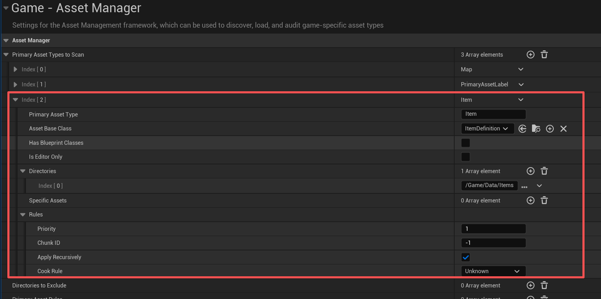

# UE资产管理笔记下：AssetManager

因为没有实际用过AssetManager，所以这篇主要是介绍UE里有这个东西可以进行资产管理，也是比较推荐进行资产管理的一种方式，对于功能细节和实现上就不做过多探究了。

`AssetManager`提供了一个更系统的能力，对于一部分资源有明确的业务身份的，例如道具、技能、角色等等配置，AssetManager能做统一的扫描、查询，异步加卸载等管理。这也是UE推荐的资产管理方式


## 如何使用

假如我们有一张物品配置表，可能是这样的

```c++
USTRUCT(BlueprintType)
struct FItemRow : public FTableRowBase
{
    
GENERATED_BODY()

    UPROPERTY(EditAnywhere, BlueprintReadOnly)
    FName DisplayName;

    UPROPERTY(EditAnywhere, BlueprintReadOnly)
    TSoftObjectPtr<UTexture2D> Icon;

    UPROPERTY(EditAnywhere, BlueprintReadOnly)
    TSoftObjectPtr<UStaticMesh> Mesh;
}
```

非常简单，这里也使用了软引用，加载表的时候不会立刻加载图标、模型。可能到了业务层，我们会自己拿到`TSoftObjectPtr`，通过同步或者异步加载Load进来，这块内容就会散落到一堆的业务代码中。

而AssetManager的管理方式是把每个物品定义成一个 `Primary Asset`，然后交给 `AssetManager` 管理。

```c++
UCLASS(BlueprintType)
class UItemDefinition : public UPrimaryDataAsset
{
    GENERATED_BODY()

public:
    static const FPrimaryAssetType AssetType;

    virtual FPrimaryAssetId GetPrimaryAssetId() const override
    {
        return FPrimaryAssetId(AssetType, GetFName());
    }

    UPROPERTY(EditDefaultsOnly, BlueprintReadOnly)
    FText DisplayName;

    UPROPERTY(EditDefaultsOnly, BlueprintReadOnly, meta = (AssetBundles = "UI"))
    TSoftObjectPtr<UTexture2D> Icon;

    UPROPERTY(EditDefaultsOnly, BlueprintReadOnly, meta = (AssetBundles = "Game"))
    TSoftObjectPtr<UStaticMesh> Mesh;
};

const FPrimaryAssetType UItemDefinition::AssetType(TEXT("Item"));
```

然后在Content目录下创建每个物品的DA。

```c++
/Game/Data/Items/DA_Item_Sword_A
/Game/Data/Items/DA_Item_Sword_B
```

然后可以在项目配置里配置目录进行自动扫描



或者是在.ini中配置

```
+PrimaryAssetTypesToScan=(PrimaryAssetType="Item",AssetBaseClass="/Script/PCGDungeon.ItemDefinition",bHasBlueprintClasses=False,bIsEditorOnly=False,Directories=((Path="/Game/Data/Items")),SpecificAssets=,Rules=(Priority=1,ChunkId=-1,bApplyRecursively=True,CookRule=Unknown))
```

之后，业务层就不需要使用资源路径，而是用`FPrimaryAssetId ItemId`来表达物品，例如

```
Item:DA_Item_Sword_A
```

我们看UItemDefinition的资产软引用上有`AssetBundles`的元数据标记，这是用来告诉AssetManager，这个资产属于某个加载分组。例如这里`Icon`属于`UI`这个Bundle，而`Mesh`属于`Game`这个Bundle，当加载Primary Asset时，可以指定Bundle进行一组资源的加载。

例如，当背包界面要显示图标时，我们只加载`UI`Bundle：

```c++
void UItemSubsystem::LoadItemForUI(FPrimaryAssetId ItemId)
{
    UAssetManager::Get().LoadPrimaryAsset(
        ItemId,
        { FName("UI") },
        FStreamableDelegate::CreateUObject(this, &UItemSubsystem::OnItemUILoaded, ItemId));
}

void UItemSubsystem::OnItemUILoaded(FPrimaryAssetId ItemId)
{
    UItemDefinition* Item = Cast<UItemDefinition>(
        UAssetManager::Get().GetPrimaryAssetObject(ItemId));
    if (!Item) return;

    UTexture2D* Icon = Item->Icon.Get();
}
```

当装备到角色身上，需要使用模型时，可以再加载`Game`Bundle

```c++
UAssetManager::Get().LoadPrimaryAsset(
    ItemId,
    { FName("Game") },
    FStreamableDelegate::CreateUObject(this, &UItemSubsystem::OnItemGameLoaded, ItemId));
```

不用时，可以直接卸载

```c++
UAssetManager::Get().UnloadPrimaryAsset(ItemId);
```

这套组织方式最大的好处就是，物品有了一个稳定的身份，即`FPrimaryAssetId`。大资源仍然是软引用，业务可以根据不同的使用场景可以通过Bundle进行区分，统一进行加载。加卸载都可以通过`AssetManager`进行统一管理。

当然，这种组织方式也对于大批量修改物品也很不方便，可以想象，假如我们有一万个物品，就要在版本管理中塞入一万个文件小碎片，也无法支持批量编辑和Excel等工具进行导入导出。所以这种组织方式更适合某种带有明确业务身份的资源型配置，而不适合纯数值表。实际使用上要结合具体业务具体分析了。


## 名词解释

* `Primary Asset` 可以理解为项目主动登记、主动管理的入口资产。它必须能给出一个稳定的 `FPrimaryAssetId`，例如上面的DA_Item_Sword_A，就是一个Primary Asset。代表一个具体的物品

* `Secondary Asset` 是被 Primary Asset 引用或管理的附属资源。面的 `Icon`、`Mesh`、 通常就是 Secondary Asset。

* `FPrimaryAssetId`则是 Primary Asset 的稳定身份，由类型和名字组成

  ```c++
  USTRUCT(BlueprintType)
  struct FPrimaryAssetId
  {
      FPrimaryAssetType PrimaryAssetType;
      FName PrimaryAssetName;
  };
  ```

* Bundle 用来表达“同一个 Primary Asset 在不同使用场景下要加载哪些附属资源”。重点是表达加载意图，上文已经说过了。
