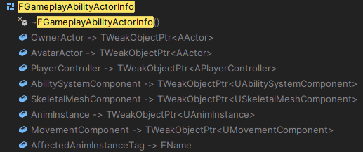
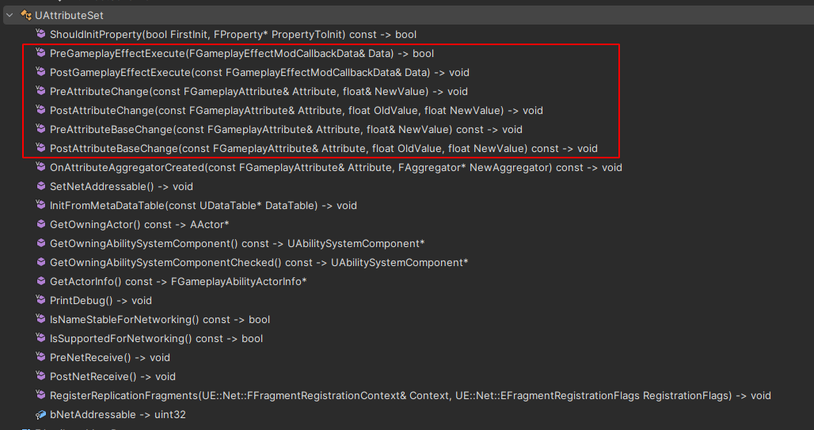

# Gas设计解析一：ASC与Attribute

GAS 是虚幻引擎的一套可扩展技能框架。它主要包含几类内容：

1. 管理基于 Actor 的属性值，也就是 Attribute。
2. 提供状态效果的管理，也就是 GameplayEffect。
3. 制作角色能力，支持等级、冷却、消耗等一系列基本需求，也就是 GameplayAbility。
4. 提供技能触发时的表现，例如特效、声音，也就是 GameplayCue。
5. 支持网络同步，能够满足多人游戏的需求。

这一篇先从 Ability System Component 和 Attribute 说起。简单来说，ASC 是 GAS 的中枢，Attribute 是被这套系统管理和修改的数据。后面的 GameplayEffect、GameplayAbility、GameplayCue、GameplayTag，最后都会回到 ASC 这里做登记、查询、应用和同步。

# Ability System Component

ASC 是这套技能系统管理的中枢。每个需要被 GAS 管理和影响的 Actor，都需要拥有一个 `UAbilitySystemComponent`。同时，这个组件继承自 `UGameplayTasksComponent`，所以它天然可以和 AbilityTask 这套异步任务机制配合。

ASC 里有两个非常关键的 Actor 引用：

```cpp
UPROPERTY(ReplicatedUsing = OnRep_OwningActor)
TObjectPtr<AActor> OwnerActor;

UPROPERTY(ReplicatedUsing = OnRep_OwningActor)
TObjectPtr<AActor> AvatarActor;
```

`OwnerActor` 是逻辑所有者，`AvatarActor` 是当前在世界中实际表现这个能力系统的物理对象。二者可能是同一个对象，也可能不是。

例如一个玩家角色身上直接挂 ASC，那么角色可以同时作为 OwnerActor 和 AvatarActor。

但如果希望技能、属性、冷却等数据在角色死亡后仍然保留，常见做法是把 ASC 放在 `PlayerState` 上。此时 `PlayerState` 是 OwnerActor，当前操作的 `Character` 是 AvatarActor。角色死亡、重生、换 Pawn，只需要重新初始化 AvatarActor，ASC 本身仍然跟随 PlayerState 存在。

这里一般不建议把 ASC 放在 `PlayerController` 上。原因很简单：客户端只知道自己的 PlayerController，不会拥有其他玩家的 PlayerController；而 PlayerState 会同步给所有客户端。

初始化这两个对象的核心入口是：

```cpp
AbilitySystemComponent->InitAbilityActorInfo(InOwnerActor, InAvatarActor);
```

`InitAbilityActorInfo` 会刷新 `FGameplayAbilityActorInfo`。这个结构体里缓存了 Owner、Avatar、PlayerController、MovementComponent、SkeletalMeshComponent、AnimInstance 等信息，方便 Ability 和 AbilityTask 在执行时快速访问。

例如 `UAbilityTask_ApplyRootMotionConstantForce` 会从 ActorInfo 里拿到 `MovementComponent`，然后执行 RootMotionSource 相关逻辑。



## 属性及自动注册

比如角色拥有血量、魔法这样的属性。如果没有 GAS，我们可以把这些值直接写进对应的 Actor 中管理。引入 GAS 之后，期待被 GAS 影响的属性会被放进 `UAttributeSet`，并注册到 ASC 中。

GAS 使用 `Attribute` 描述一个具体属性，使用 `AttributeSet` 承载一组属性。一个角色可以有多个 AttributeSet，例如：

- `UHealthAttributeSet` 保存生命、护盾、生命恢复。
- `UCombatAttributeSet` 保存攻击力、暴击率、护甲。
- `UWeaponAttributeSet` 保存某件武器运行时附加的属性。

ASC 中保存 AttributeSet 的成员是：

```cpp
UPROPERTY(Replicated, ReplicatedUsing = OnRep_SpawnedAttributes, Transient)
TArray<TObjectPtr<UAttributeSet>> SpawnedAttributes;
```

它记录当前 ASC 已经拥有的 AttributeSet。源代码中还提供了用于操作它的接口：

```cpp
void AddSpawnedAttribute(UAttributeSet* Attribute);
void RemoveSpawnedAttribute(UAttributeSet* Attribute);
void RemoveAllSpawnedAttributes();
void SetSpawnedAttributesListDirty();
```

### 构造期注册

最常见的方式是在 OwnerActor 的构造函数中创建 AttributeSet 子对象：

```cpp
HealthSet = CreateDefaultSubobject<UHealthAttributeSet>(TEXT("HealthSet"));
```

ASC 初始化时会查找 OwnerActor 下面的 AttributeSet 子对象，并把它们加入 `SpawnedAttributes`。这种方式最稳定，也最符合 GAS 的默认假设。

### 运行时注册

也可以在运行时添加 AttributeSet，例如武器装备后临时添加武器属性：

```cpp
AbilitySystemComponent->AddSpawnedAttribute(WeaponAttributeSet);
AbilitySystemComponent->ForceReplication();
```

移除时使用：

```cpp
AbilitySystemComponent->RemoveSpawnedAttribute(WeaponAttributeSet);
AbilitySystemComponent->ForceReplication();
```

这里需要注意一个同步问题：如果服务端移除了某个 AttributeSet，而客户端随后才收到这个 AttributeSet 内某个属性的复制更新，就可能出现客户端找不到 AttributeSet 的情况。运行时移除 AttributeSet 要非常谨慎，尤其不要在相关 GameplayEffect、属性复制和预测效果还没有干净结束时直接移除。

## ASC 的关键成员

ASC 里有几个关键的成员变量：

```cpp
FGameplayAbilitySpecContainer ActivatableAbilities;
FActiveGameplayEffectsContainer ActiveGameplayEffects;
FActiveGameplayCueContainer ActiveGameplayCues;
```

`ActivatableAbilities` 保存已经授予 ASC 的 Ability。Ability 需要先被授予，才能被激活。

`ActiveGameplayEffects` 保存已经作用在 ASC 上的 GameplayEffect。Duration 和 Infinite 类型的 GE 会在这里留下 ActiveGameplayEffect，Instant GE 则通常执行完就结束；预测场景下，客户端会把预测 Instant GE 临时当作 Infinite 来处理。

`ActiveGameplayCues` 保存当前激活的 GameplayCue 状态。Cue 更偏表现层，例如持续燃烧特效、命中特效、声音等。

# Attribute

GAS 中的属性本质是一组float，但是被包装成了一个特殊的结构体，即 `FGameplayAttributeData`：

```cpp
USTRUCT(BlueprintType)
struct FGameplayAttributeData
{
	GENERATED_BODY()

protected:
	UPROPERTY(BlueprintReadOnly, Category = "Attribute")
	float BaseValue;

	UPROPERTY(BlueprintReadOnly, Category = "Attribute")
	float CurrentValue;
};
```

它有两个值：

- `BaseValue`：基础值，可以理解为属性的长期值。
- `CurrentValue`：当前值，可以理解为基础值加上当前所有临时修正后的结果。

例如角色的基础生命上限是 100，装备和 Buff 让它临时变成 130，那么 100 就是这个 BaseValue，130 则是 CurrentValue。

Instant GameplayEffect 通常修改 BaseValue。Duration 和 Infinite GameplayEffect 的 Modifier 则通常在效果生效期间参与属性计算，影响 CurrentValue。这也很好理解，即时 GE 改完就结束，因此可以直接改动 BaseValue；持续 GE 后续还会被移除，所以更适合让 Modifier 临时参与当前值计算，结束后再重新算回去。

## 定义 Attribute

项目里通常会写一个宏来生成 Attribute 的访问器：

```cpp
#define ATTRIBUTE_ACCESSORS(ClassName, PropertyName) \
	GAMEPLAYATTRIBUTE_PROPERTY_GETTER(ClassName, PropertyName) \
	GAMEPLAYATTRIBUTE_VALUE_GETTER(PropertyName) \
	GAMEPLAYATTRIBUTE_VALUE_SETTER(PropertyName) \
	GAMEPLAYATTRIBUTE_VALUE_INITTER(PropertyName)
```

然后在 AttributeSet 中定义属性：

```cpp
UPROPERTY(BlueprintReadOnly, ReplicatedUsing = OnRep_Health)
FGameplayAttributeData Health;
ATTRIBUTE_ACCESSORS(UHealthAttributeSet, Health)
```

复制回调中通常使用：

```cpp
GAMEPLAYATTRIBUTE_REPNOTIFY(UHealthAttributeSet, Health, OldValue);
```

这样 GAS 才能正确感知属性复制带来的变化。

## 修改 Attribute 的方式

修改 Attribute 有两种方式：

1. 直接使用 Setter 修改属性。
2. 通过 GameplayEffect 修改属性。

Setter 更像是代码层面的直接赋值，适合初始化或少量明确场景。项目中的主要属性变化，通常应该通过 GameplayEffect 完成。

原因也不复杂：GameplayEffect 承担了 Attribute 修改的媒介角色。受到伤害、获得治疗、增加 Buff、触发消耗，都是“某种效果作用到 ASC 上”。如果都绕过 GE 直接写值，后面就很难统一处理预测、标签、堆叠、持续时间、GameplayCue 和网络同步。

## 修改过程中的关键函数

AttributeSet 提供了一组重要钩子，项目中经常会重写它们：



`PreAttributeChange` 在 CurrentValue 变化前调用，适合做限制操作，例如 Clamp。它接收的是引用参数，可以直接修正即将写入的值。

```cpp
void UHealthAttributeSet::PreAttributeChange(
	const FGameplayAttribute& Attribute,
	float& NewValue)
{
	if (Attribute == GetHealthAttribute())
	{
		NewValue = FMath::Clamp(NewValue, 0.f, GetMaxHealth());
	}
}
```

`PostAttributeChange` 在 CurrentValue 变化后调用，适合做依赖属性的后续处理。

`PreGameplayEffectExecute` 在 Instant GameplayEffect 执行前调用，返回 `false` 可以阻止这次修改继续执行。

`PostGameplayEffectExecute` 在 Instant GameplayEffect 执行后调用，适合处理伤害结算、死亡判断、把 Meta Attribute 清零等逻辑。

还有属性变化委托：

```cpp
AbilitySystemComponent
	->GetGameplayAttributeValueChangeDelegate(GetHealthAttribute())
	.AddUObject(this, &ThisClass::OnHealthChanged);
```

委托参数是：

```cpp
struct FOnAttributeChangeData
{
	FGameplayAttribute Attribute;
	float NewValue;
	float OldValue;
	FGameplayEffectModCallbackData* GEModData;
};
```

其中 `GEModData` 只在服务端执行 GameplayEffect 修改时可靠存在。客户端收到属性复制时，不应假设这里一定有完整的 GE 上下文。

# 总结

ASC 是 GAS 的状态中枢，OwnerActor 决定逻辑归属，AvatarActor 决定当前世界中的执行对象。AttributeSet 负责承载属性，`SpawnedAttributes` 负责把这些属性注册给 ASC。

Attribute 自身通过 BaseValue 和 CurrentValue 区分长期值与当前值。真正的玩法修改通常应该通过 GameplayEffect 进入系统，这样后续的预测、堆叠、标签、持续时间和表现层才有统一入口。下一篇会从这个入口继续往下看：GE 如何从一份数据配置变成 ASC 上的持续状态或一次即时结算。

关键代码:

- `UAbilitySystemComponent::InitAbilityActorInfo`
- `UAbilitySystemComponent::InitializeComponent`
- `UAbilitySystemComponent::AddSpawnedAttribute`
- `UAbilitySystemComponent::RemoveSpawnedAttribute`
- `UAttributeSet::PreAttributeChange`
- `UAttributeSet::PostGameplayEffectExecute`
