# Gas设计解析二：GameplayEffect

上一篇说到，Attribute 的修改通常应该通过 GameplayEffect 进入系统。这一篇就看 GE 本身。GE 是 GAS 中最容易被误解的对象之一，因为它既能改属性，也能授予 Tag、授予 Ability、表达 Cost 和 Cooldown。它本质是一个数据化的配置，最终影响效果如何作用到 ASC 上。

GameplayEffect 可以理解为修改 Attribute 和 GameplayTag 的数据容器。它定义“发生了什么效果”，例如一次伤害、治疗、持续 Buff、冷却状态、免疫状态。

GE 有三种持续类型：

1. `Instant`：立即执行，执行完通常不保留 ActiveGameplayEffect。
2. `Duration`：有持续时间，会进入 ActiveGameplayEffects。
3. `Infinite`：无限持续，直到被主动移除。

它只是一个定义单一游戏效果的数据类，或者叫 Buff 配置。不应该承载太多额外流程逻辑。流程逻辑应当在 GameplayAbility、AbilityTask、ExecutionCalculation 或项目自己的系统里完成。GE 的职责是把“这次效果如何影响 ASC”描述清楚。

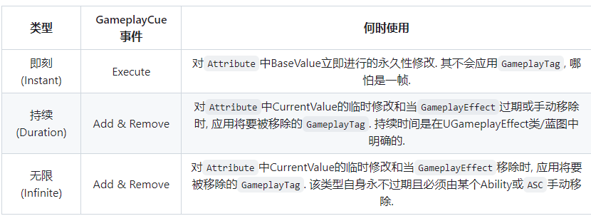

对于可以设定周期应用的 Duration 和 Infinite GE，每经过一段时间会执行一次 Effect。源码里这类 Periodic GameplayEffect 每次周期触发都会被当作 Instant 执行。值得注意的是，周期性 GE 不能被客户端预测。

# 如何为自己添加 GE

GameplayEffect 本身不是按使用次数实例化的对象。应用一个 GE 时，系统会从 `UGameplayEffect` 的 CDO 创建一个 `FGameplayEffectSpec`。Spec 再被应用到目标 ASC，并由 `FActiveGameplayEffectsContainer` 追踪。

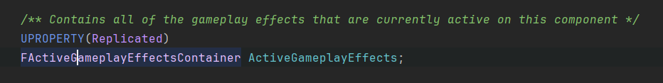

`FGameplayEffectSpec` 可以理解为“这次具体应用”的运行时数据。它保存：

- 使用的是哪个 `UGameplayEffect` 定义。
- GE 等级是多少。
- 谁是 Instigator，谁是 EffectCauser。
- 这次应用的 Context。
- 捕获到的 Source/Target Tag。
- Modifier 运行时计算出的 Magnitude。
- SetByCaller 传入的运行时值。

简单说，GameplayEffect 是模板，GameplayEffectSpec 是这次应用的实例数据。名字里虽然没有 Instance，但它做的就是这件事。命名这块 GAS 一直很有自信。

实际保存在 ASC 中的也不是 `FGameplayEffectSpec`，而是 `FActiveGameplayEffect`。它会再包一层，附加开始时间、持续时间、周期执行时间、Stack 层数、预测 Key 等运行状态。

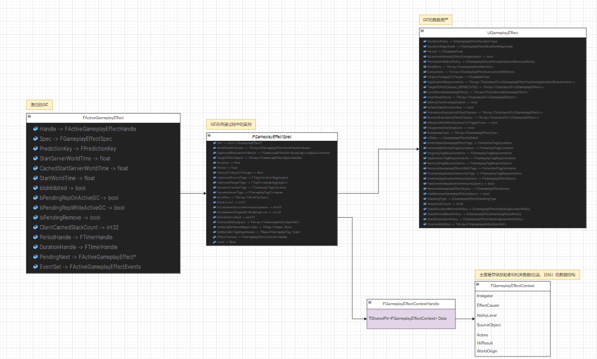

两个核心入口：

```cpp
UAbilitySystemComponent::ApplyGameplayEffectSpecToSelf()
FActiveGameplayEffectsContainer::RemoveActiveEffects()
```

`ApplyGameplayEffectSpecToSelf` 会做一系列检查：

1. 是否有权限应用。服务端可以应用；客户端必须持有有效 PredictionKey 才能预测应用。
2. Attribute Modifier 是否满足应用条件。
3. 概率、Tag Requirement、自定义 Application Requirement 是否通过。
4. 是否被免疫规则阻挡。
5. 是否能加入 ActiveGameplayEffects，或者作为 Instant GE 直接执行。
6. 是否需要触发 Linked GameplayEffect、GameplayCue 和应用回调。

最终，Duration 和 Infinite GE 会留在 `ActiveGameplayEffects` 中。Instant GE 会执行 Modifier 或 Execution 后结束。

# 移除与堆叠

Duration 和 Infinite GE 可以被移除。移除时系统不一定直接删除整个效果，也可能只是扣除 Stack 层数。

GE 的堆叠方式主要有两种：

- `BySource`：按来源 ASC 分开计算层数。每个来源都有自己的层数限制。
- `ByTarget`：不关心来源，只看目标 ASC 上这个效果是否已经达到层数上限。

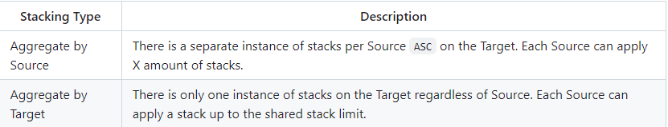

堆叠时还会涉及：

- 到达上限后是否刷新持续时间。
- 到达上限后是否刷新周期。
- 溢出时是否应用其他 GE。
- 移除一层时是否清空整个 Stack。

所以 Stack 不只是一个整数。它和持续时间、周期、溢出效果、Tag 状态都有关系。写 Buff 系统时如果只看层数，很容易把“叠满以后发生什么”漏掉。

# GE 中的 Tag

GameplayEffect 大量使用 GameplayTag。常见用途包括：

- Asset Tag：描述这个 GE 自身是什么。
- Granted Tag：GE 激活期间授予目标 ASC 的标签。
- Application Requirement：决定这个 GE 能不能应用。
- Ongoing Requirement：决定这个 GE 当前是否处于生效状态。
- Removal Requirement：决定是否移除已有 GE。
- Immunity：决定是否免疫某类 GE。

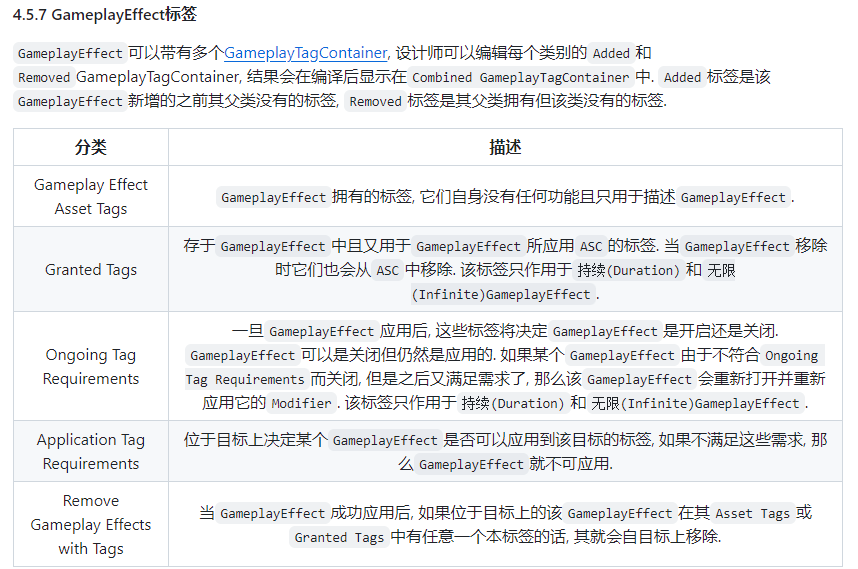

通过这些 Tag，就可以完成效果互斥、状态门控和免疫判断。

例如角色有 `State.Invincible` 时，伤害 GE 被拒绝；角色有 `State.Stunned` 时，移动速度 Buff 的 Ongoing 条件不满足，于是效果还在，但 Modifier 暂时不生效。这样比在每个技能里写分支要干净得多。

Ongoing Requirement 和 Application Requirement 有一个重要区别：

- Application Requirement 决定“能不能进门”。
- Ongoing Requirement 决定“进门之后当前能不能工作”。

前者失败，GE 不会被应用。后者失败，GE 可以保留在 ActiveGameplayEffects 里，只是它授予的 Tag 和 Modifier 会暂时失效，等条件满足后再恢复。

# 如何作用于属性

GE 有两种主要方式修改 Attribute：

1. `GameplayEffectModifier`
2. `GameplayEffectExecutionCalculation`

Modifier 支持预测。ExecutionCalculation 不支持预测。

## GameplayEffectModifier

Modifier 是 GE 成员变量中的一组配置：

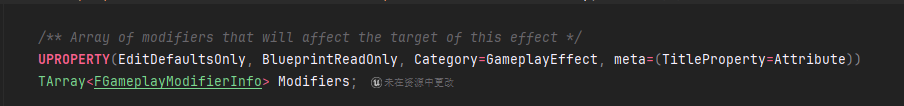

一个 Modifier 修改一个 Attribute。它由三部分组成：

1. 修改哪个 Attribute。
2. 使用什么操作：`Add`、`Multiply`、`Divide`、`Override`。
3. Magnitude 如何计算。

一个 GE 可以有多个 Modifier，所以一次 GE 应用可以同时修改多个 Attribute。但每个 Modifier 自身仍然只负责一个 Attribute。

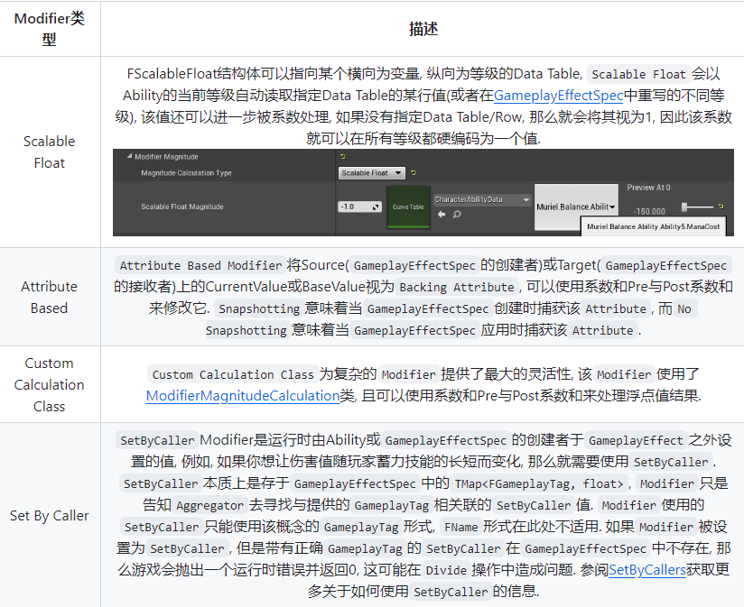

Magnitude 主要有四种计算方式：

- `ScalableFloat`：直接数值，或者按 Level 从 CurveTable/DataTable 取值。
- `AttributeBased`：基于 Source 或 Target 的某个 Attribute 计算。
- `CustomCalculationClass`：使用 `UGameplayModMagnitudeCalculation` 自定义计算，简称 MMC。
- `SetByCaller`：由外部在 Spec 上设置运行时数值。

下一篇会结合案例展开这四种方式。

这里先总结一句：Modifier 会计算出一个 float，然后按照 ModifierOp 把这个 float 应用到目标 Attribute 上。它能力有限，但正因为有限，所以可预测、可同步、可组合。

## GameplayEffectExecutionCalculation

ExecutionCalculation 是 GE 修改 ASC 最强的方式之一。

它通过 `UGameplayEffectExecutionCalculation::Execute_Implementation` 执行，可以读取捕获到的 Source/Target Attribute、Tag、EffectContext、SetByCaller 数据，并输出多个 `FGameplayModifierEvaluatedData`。

也就是说，它可以一次修改多个 Attribute，可以写复杂伤害公式，可以做护盾优先扣减、护甲减伤、生命偷取、暴击修正等逻辑。

代价也很明确：它不能被预测。

原因不难理解。ExecutionCalculation 允许项目代码执行任意逻辑，客户端很难保证自己和服务端拥有完全一致的输入、时序和结果。GAS 在这里选择让服务端裁决。客户端想提前表现，可以播放预测 Cue 或本地表现，但最终属性结果要等服务端。

# 如何授予新的 Ability

GE 还可以授予 Ability。

一种常见做法是：应用一个 GE，GE 在激活期间授予一个自动激活或可激活的 Ability。这个能力会在 GE 存在时有效，GE 被移除后能力也随之撤销。

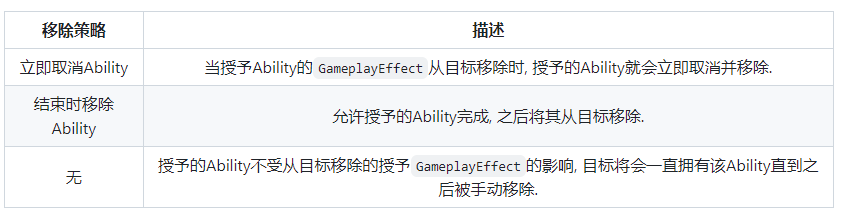

入口仍然在 `ApplyGameplayEffectSpec` 一侧。大致调用栈可以观察到：

```cpp
FActiveGameplayEffectsContainer::ApplyGameplayEffectSpec
  FActiveGameplayEffectsContainer::InternalOnActiveGameplayEffectAdded
    FActiveGameplayEffect::CheckOngoingTagRequirements
      FActiveGameplayEffectsContainer::AddActiveGameplayEffectGrantedTagsAndModifiers
```

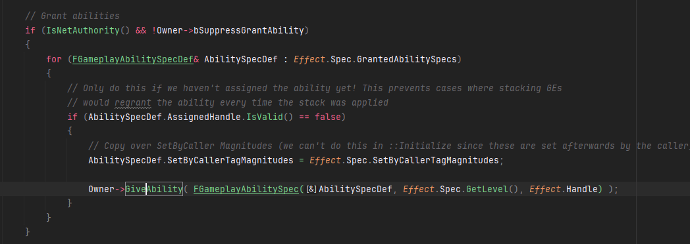

这个机制适合做装备技能、状态技能、临时被动等内容。

例如拾取某件武器后应用一个 Infinite GE，它授予 `GA_WeaponFire`。卸下武器时移除 GE，Ability 自动失效。这样能力来源和能力生命周期能绑在一起，不需要到处手写 Give/Remove Ability。

# 为什么免疫这么特殊

上文提到，GE 可以通过 Tag Requirement 做互斥和阻挡。但 GE 仍然提供了单独的 Immunity 配置。

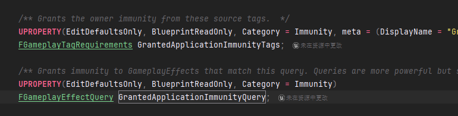

单独提供 Immunity 的一个原因是它能触发更明确的阻挡回调，例如：

```cpp
UAbilitySystemComponent::OnImmunityBlockGameplayEffectDelegate
```

这样项目可以在“效果被免疫”时做专门表现，例如播放格挡反馈、记录战斗日志。

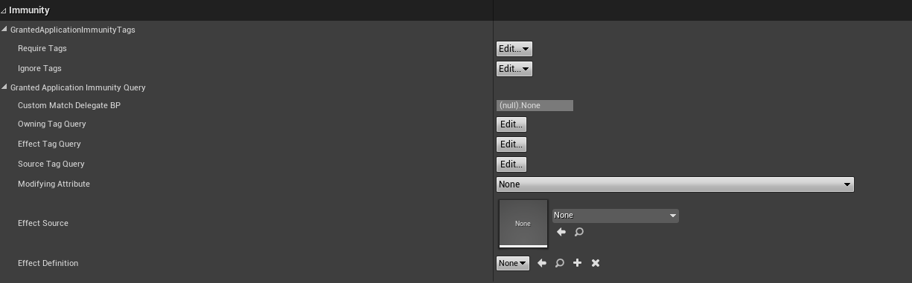

无论是 Tag Requirement 还是 Immunity，最终都是在 GE 应用流程中检查。源码入口仍然能在 `ApplyGameplayEffectSpecToSelf` 附近看到。

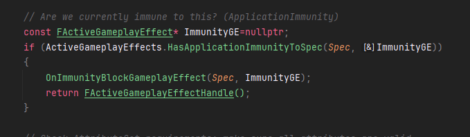

所以可以这样理解：Tag Requirement 更像“通用门禁”，Immunity 更像“带通知能力的专用门禁”。

功能上都能挡住 GE，但 Immunity 给了更明确的语义和回调。

# 特殊的 GE Cost

Cost GE 是 GameplayAbility 专门使用的一类 GE。它的目的是描述激活 GA 时需要消耗的 Attribute。

一般来说，Cost GE 应该是 Instant，并带有一个或多个 Attribute 减值 Modifier。例如消耗 20 点 Mana，就给 Mana 一个 `Add -20` 的 Modifier。

激活 Ability 前，`CheckCost` 会检查当前属性是否足够支付。真正激活后，`ApplyCost` 会应用 Cost GE。

Cost GE 常见写法：

- 固定消耗：使用 ScalableFloat。
- 根据技能等级变化：使用 ScalableFloat + 曲线。
- 根据蓄力时间变化：使用 SetByCaller。
- 根据角色属性变化：使用 MMC 或 AttributeBased。

Cost GE 不应该顺手写复杂技能逻辑。它的名字已经说得很清楚：只管成本。能把账算明白就很好。

# 特殊的 GE Cooldown

Cooldown GE 也是 GameplayAbility 专门使用的一类 GE。它通常是 Duration GE，并在持续期间授予一个 Cooldown Tag。

例如：

- `Cooldown.Fireball`
- `Cooldown.Dash`
- `Cooldown.Weapon.Primary`

激活 Ability 前，`CheckCooldown` 会检查 ASC 上是否已经存在对应 Cooldown Tag。如果存在，就不能再次激活。

激活成功后，`ApplyCooldown` 应用 Cooldown GE。GE 持续期间授予 Cooldown Tag；持续时间结束后，GE 被移除，Tag 也随之消失。

Cooldown GE 的核心不是改 Attribute，而是授予 Tag 和记录持续时间。把冷却状态变成 Tag 后，UI、输入、技能互斥都可以查询同一套数据。

# 总结

GameplayEffect 是 GAS 中描述“效果如何作用于 ASC”的数据模板。应用时会生成 Spec，进入 ActiveGameplayEffects 后再由 ActiveGameplayEffect 追踪运行状态。

GE 可以通过 Modifier 修改 Attribute，也可以通过 ExecutionCalculation 做复杂服务端结算；可以授予 Tag、授予 Ability、表达 Cost、表达 Cooldown，还能处理 Stack、Immunity 和 Ongoing 条件。

下一篇会把“GE 如何修改 Attribute”单独拆出来，用 Modifier、AttributeBased、MMC、SetByCaller 和 Execution 这几种方式顺着源码走一遍。

关键代码:

- `UAbilitySystemComponent::ApplyGameplayEffectSpecToSelf`
- `FActiveGameplayEffectsContainer::ApplyGameplayEffectSpec`
- `FActiveGameplayEffectsContainer::ExecuteActiveEffectsFrom`
- `FActiveGameplayEffectsContainer::InternalExecuteMod`
- `FActiveGameplayEffect::CheckOngoingTagRequirements`
- `UGameplayAbility::CheckCost`
- `UGameplayAbility::ApplyCooldown`
