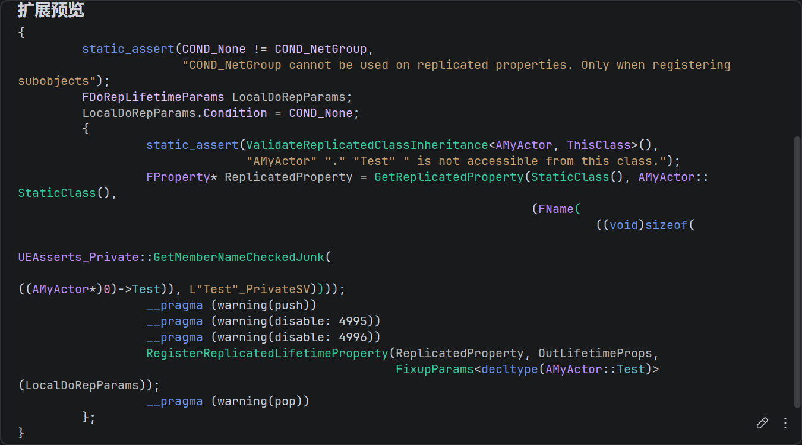

# 注册复制属性


## 注册写法

一个典型的写法如下
```c++
class AMyActor : public AActor
{
	GENERATED_BODY()
	
	UPROPERTY(Replicated)
	bool Test;

	virtual void GetLifetimeReplicatedProps(TArray<class FLifetimeProperty>& OutLifetimeProps) const override
	{
		Super::GetLifetimeReplicatedProps(OutLifetimeProps);
		
		DOREPLIFETIME_CONDITION(AMyActor, Test, COND_None)
	};
};
```

这里有两处声明。第一处是 `UPROPERTY(Replicated)` ，UHT会把这个字段标记成带复制语义的`FProperty`给反射系统。第二处则是`GetLifetimeReplicatedProps` 和`DOREPLIFETIME`。这是告诉网络系统，这个类的这个属性，将会进入复制列表

可以看下宏展开



这里其实有很多细节，一一解释下。

```c++
FDoRepLifetimeParams LocalDoRepParams;
LocalDoRepParams.Condition = COND_None;
```

`FDoRepLifetimeParams` 可以理解为复制注册时的附加配置，字段例如。主要作用很简单，就是描述这个属性在复制布局里的复制规则，具体不赘述了。

```c++
FDoRepLifetimeParams LocalDoRepParams;
LocalDoRepParams.Condition = COND_None;
LocalDoRepParams.RepNotifyCondition = REPNOTIFY_OnChanged;
LocalDoRepParams.bIsPushBased = false;
```

核心展开这一段

```c++
static_assert(ValidateReplicatedClassInheritance<AMyActor, ThisClass>(),"AMyActor" "." "Test" " is not accessible from this class.");

FProperty* ReplicatedProperty = GetReplicatedProperty(StaticClass(), AMyActor::StaticClass(),
(FName(((void)sizeof(UEAsserts_Private::GetMemberNameCheckedJunk(((AMyActor*)0)->Test)), L"Test"_PrivateSV))));

RegisterReplicatedLifetimeProperty(ReplicatedProperty, OutLifetimeProps,FixupParams<decltype(AMyActor::Test)>(LocalDoRepParams));
```

`ValidateReplicatedClassInheritance`这里是检查当前类和写入的AMyActor继承关系是否合法，如果是继承关系或者同一个类，就能过断言，否则输出错误信息

`GetReplicatedProperty`则是通过反射系统，最终拿到一个`FProperty`,这是反射层的属性描述对象，里面包含了诸如属性名、类型、在对象内存中的偏移等等。在这个例子中，它对应的是bool属性描述，即`FBoolProperty`

这个宏展开里运用了一个C++技巧

```c++
FName((sizeof(UEAsserts_Private::GetMemberNameCheckedJunk(((AMyActor*)0)->Test))), L"Test"_PrivateSV))
```

`((ACharacter*)0)->bIsCrouched`，这是一个类成员访问表达式，这里在危险的访问空指针，但是此表达式又被`Sizeof`包裹，`sizeof`如果应用于表达式，并不会真正进行求值，所以这里并不会真的进行解引用，可以见https://en.cppreference.com/cpp/language/sizeof。

因此，这段内容其实是在强迫编译器进行编译期类型检查，确认AMyActor是不是真的有Test这个成员。这一长串其实基本等价于下面这段，这样就很清楚了。

```c++
FProperty* ReplicatedProperty = GetReplicatedProperty(StaticClass(), AMyActor::StaticClass(),(FName(TEXT("Test"));
```

最后`RegisterReplicatedLifetimeProperty` 是为了返回`OutLifetimeProps`，那些属性要复制，以及用什么规则复制等内容，最终都会登记到`OutLifetimeProps`中，交给后续的`FRepLayout`消费。


## FRepLayOut

通常当某个类第一次参与网络复制时，引擎要为这个类创建FRepLayout。可以看到，这里是通过CDO来调用`GetLifetimeReplicatedProps`

```c++
FRepLayout::CreateFromClass
	RepLayout->InitFromClass
        UObject* Object = InObjectClass->GetDefaultObject();
		Object->GetLifetimeReplicatedProps(LifetimeProps);
```

见`UNetDriver::GetObjectClassRepLayout`，RepLayoutMap缓存了所有的UClass的属性复制信息。

```c++
TSharedPtr<FRepLayout> UNetDriver::GetObjectClassRepLayout( UClass * Class )
{
    TSharedPtr<FRepLayout>* RepLayoutPtr = RepLayoutMap.Find(Class);

    if (!RepLayoutPtr)
    {
       ECreateRepLayoutFlags Flags = MaySendProperties() ? ECreateRepLayoutFlags::MaySendProperties : ECreateRepLayoutFlags::None;
       RepLayoutPtr = &RepLayoutMap.Add(Class, FRepLayout::CreateFromClass(Class, ServerConnection, Flags));
    }

    return *RepLayoutPtr;
}
```

`OutLifetimeProps` 是在 `GetLifetimeReplicatedProps` 里声明出来的“原始复制属性列表”。`FRepLayout` 是引擎根据这份列表、反射信息、属性类型、条件、RepNotify 等内容生成对应的UClass/UStruct/UFunction的“网络复制布局”。

`FRepLayout`引擎这里写了一大段注释，总结内容如下

1. FRepLayout负责保存某个类型的可复制属性信息，诸如读取、写入属性状态，比较前后变化、序列/反序列网络数据。同一个类型只会有一个FRepLayout，描述的是类型的复制规则。
2. Commands：描述某个属性，例如类型、内存中的布局、如何序列化，如何比较值，变化时是否触发RepNotify等等。
3. 关于顶层属性命令（`FRepParentCmd`）和子属性命令（`FRepLayoutCmd`），例如如果是一个C风格的数据，会有一个父命令和数组中每个元素生成一个子命令等等。
4. `ChnageLists`：不保存属性值，而保存哪些属性发生了变化，存储的是Property Handle。发送前，依次比较Layout Commands的状态，如果属性不同，就把handle写入。它的作用是告诉复制系统，这次需要处理这些属性。
5. 接受时候发送数据里就已经带上了handle，通过handle找到对应的Layout Command，再反序列化属性值。
6. 丢包与重发机制：维护一个缓冲区跟踪最近发送的变更列表
   1. 收到 ACK：说明包到了，可以删除这条历史。
   2. 收到NAK：包丢了，把对应的`Changelist`合并进下一次复制，重新发送
   3. 长时间无ACK/NAK，为了避免缓冲区溢出，会把历史里的`Changelist`合并一起发

这里基本解释了属性同步各种相关细节。

