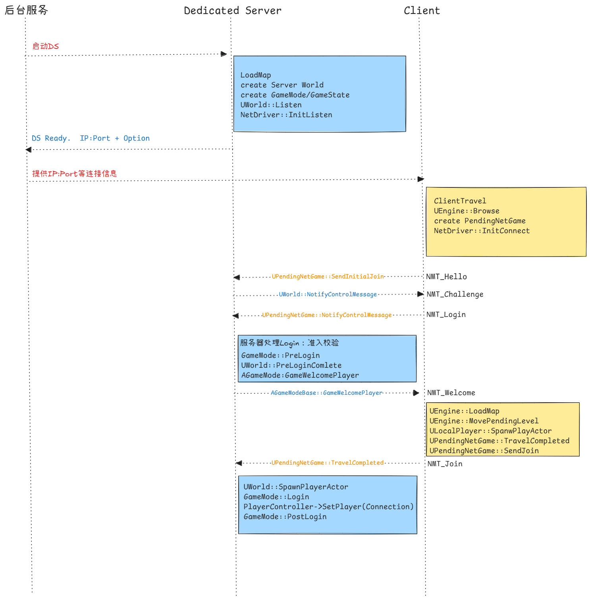

# 网络笔记二：DS和客户端连接

# 零：登录流程

下文会参照该时序图分析，大致分成三个阶段

1. DS启动并就绪，等待客户端连接
2. 客户端发起连接请求，和DS进行握手通信
3. 地图加载完成后进行Join入场



## 概念解析

### Dedicated Server

Dedicated Server大概可以翻译成专用服务器或者独立服务器。我觉得这个名字主要是和Listen Server区分开，后者意思是一个玩家客户端同时也是服务器，这个进程既有本地玩家、有渲染有输入、也接受其他客户端的连接。Dedicated则更突出体现它是单独的服务器进程。

对一个常见的单局游戏，后台服务、DS 和客户端的关系大致是

- 后台服务启动远端的DS进程，指定地图和端口
- DS LoadMap之后创建出Server World，监听客户端连接
- 客户端会先建立PendingNetGame的连接态，客户端拿到地址和端口后，请求建立连接，双方创建好Connection，完成登录请求。
- 客户端LoadMap，创建Client World，进入对局。

### **`PendingNetGame`**

`UPendingNetGame` 是客户端连接远端服务器时的过渡对象。它存在于 `ClientTravel` 之后、正式 Client World 建立之前，负责持有目标 `URL`、临时 `PendingNetDriver`、到服务器的 `ServerConnection`、连接错误、地图名以及是否连接成功等状态。

### **`Control Message`**

`NMT_Hello`、`NMT_Challenge`、`NMT_Login`、`NMT_Welcome`、`NMT_Netspeed`、`NMT_Join` 都是控制通道上的消息。通常在`UWorld::NotifyControlMessage` 或 `UPendingNetGame::NotifyControlMessage` 中处理。可以理解为一段特定格式编排的消息，也是通过包装成Packet，通过`ControllerChannel`通道收发，进行连接握手，并推动各自的流程。

# 一、DS启动：**`LoadMap`、`GameMode` 和 Listen**

DS进程启动后，为了创建Server World，会进入到`UEngine::Browse` ，解析地图名后，再进入到`UEngine::LoadMap`加载地图。我们把它作为起点进行叙述。

这部分内容在[https://www.youtube.com/watch?v=IaU2Hue-ApI](https://www.youtube.com/watch?v=IaU2Hue-ApI) 也有非常详细的提及。

注意下面这段`UEngine::LoadMap`中，客户端和服务器都会调用，但是时机不同，流程大致相似。

```cpp
bool UEngine::LoadMap( FWorldContext& WorldContext, FURL URL, class UPendingNetGame* Pending, FString& Error )
{
		// ...
		
		// 1. 卸载旧world、关闭旧NetDriver
		if(worldContext.World())
		{
			// Clean up networking
			ShutdownWorldNetDriver(WorldContext.World());
			WorldContext.SetCurrentWorld(nullptr);
		}
		
		// 2. 加载地图包,把新world设置为当前world
		UPackage* WorldPackage = FindPackage(nullptr, *URL.Map);
    if (WorldPackage == nullptr)
    {
        WorldPackage = LoadPackage(nullptr, *URL.Map, LOAD_None);
    }
    UWorld* NewWorld = UWorld::FindWorldInPackage(WorldPackage);
    NewWorld->SetGameInstance(WorldContext.OwningGameInstance);
    GWorld = NewWorld;
    WorldContext.SetCurrentWorld(NewWorld);
    WorldContext.World()->InitWorld();
    
    // 3. DS 上会创建 GameMode；客户端加载网络地图时这里会因为 NM_Client 跳过。
    WorldContext.World()->SetGameMode(URL);
    
    // 4. 开始监听客户端连接
    if (Pending == NULL && (!GIsClient || URL.HasOption(TEXT("Listen"))))
    {
        WorldContext.World()->Listen(URL);
    }
    
    // 5. 初始化Actor,运行世界
    {
        FRegisterComponentContext Context(WorldContext.World());
        WorldContext.World()->InitializeActorsForPlay(URL, true, &Context);
    }

    WorldContext.World()->BeginPlay();
		 
}
```

- `GameMode`只在Ds上存在，客户端是不会创建的。

```cpp
bool UWorld::SetGameMode(const FURL& InURL)
{
	if (!IsNetMode(NM_Client) && !AuthorityGameMode)
	{
			AuthorityGameMode = GetGameInstance()->CreateGameModeForURL(InURL, this);
		// ...
	}

	return false;
}
```

- `WorldContext.World()->Listen(URL);` 中创建的 `GameNetDriver`，就是服务器挂在 `UWorld` 上的网络驱动器，主控网络事务。

```cpp
bool UWorld::Listen(FURL& InURL)
{
    if (GEngine->CreateNamedNetDriver(this, NAME_GameNetDriver, NetDriverDefinition))
    {
        NetDriver = GEngine->FindNamedNetDriver(this, NAME_GameNetDriver);
        NetDriver->SetWorld(this);
        //...
    }

    FString Error;
    if (!NetDriver->InitListen(this, InURL, bReuseAddressAndPort, Error))
    {
        GEngine->BroadcastNetworkFailure(this, NetDriver, ENetworkFailure::NetDriverListenFailure, Error);
        GEngine->DestroyNamedNetDriver(this, NetDriver->NetDriverName);
        NetDriver = nullptr;
        return false;
    }
    
    //...
}
```

# 二、客户端DS握手连接

## `ClientTravel`

客户端也会拿到后台服务提供的URL，例如ip地址 + 端口号 + 连接信息，然后执行`ClientTravel` ，发起连接请求。`ClientTravel` 可以理解为通用的切换地图的请求函数入口。

客户端发起连接前，通常已经在一个本地地图里了，例如Entry或大厅之类。这个本地的World会有本地`ULocalPlayer`和本地的`PlayerController`。这里调用`PlayerController->ClientTravel` ，用的就是这个本地`PlayerController` ，所以这里以`PlayerController->ClientTravel` 作为客户端侧的入口函数。

```cpp
void APlayerController::ClientTravel(const FString& URL, ETravelType TravelType, bool bSeamless, FGuid MapPackageGuid)
{
    ClientTravelInternal(URL, TravelType, bSeamless, MapPackageGuid);
}

void APlayerController::ClientTravelInternal_Implementation(const FString& URL, ETravelType TravelType, bool bSeamless, FGuid MapPackageGuid)
{
    UWorld* World = GetWorld();

    PreClientTravel(URL, TravelType, bSeamless);

    if (bSeamless && TravelType == TRAVEL_Relative)
    {
        World->SeamlessTravel(URL);
    }
    else
    {
        GEngine->SetClientTravel(World, *URL, (ETravelType)TravelType);
    }
}
```

这里并不是立刻连接，而是通过`SetClientTravel`，记录下URL，把请求交给Engine。

```cpp
void UEngine::SetClientTravel(UWorld* InWorld, const TCHAR* NextURL, ETravelType InTravelType)
{
	FWorldContext& Context = GetWorldContextFromWorldChecked(InWorld);

	// set TravelURL. Will be processed safely on the next tick in UGameEngine::Tick().
	Context.TravelURL = NextURL;
	Context.TravelType = InTravelType;

	// ...
}
```

UE 的连接服务器和切换地图共用同一套 Travel 机制。`ClientTravel` / `ServerTravel` 只是把目标 URL 写入对应状态。

真正执行发生在 `UEngine::TickWorldTravel`，本地地图进入 `LoadMap`，网络地址在客户端进入 `UPendingNetGame` 的分支处理。

## `UEngine::TickWorldTravel`

`UEngine::TickWorldTravel` 是`Engine`每帧用来推进“换图 / 连接 / `PendingNetGame`”的入口。

下面代码是一个客户端视角的简化流程。

```cpp
void UEngine::TickWorldTravel(FWorldContext& Context, float DeltaSeconds)
{
			// ... 只关注 ClientTravel
			
			// 1. 消费 TravelURL
			// URL是远端DS的话,创建PendingGame -> InitNetDriver -> InitConnect [*] 
			// 发送连接信息建立起ServerConnection
			if (!Context.TravelURL.IsEmpty())
			{
			    if (Browse(Context, FURL(&Context.LastURL, *TravelURLCopy, (ETravelType)Context.TravelType), Error) == EBrowseReturnVal::Failure)
			    {
			        ...
			    }
			}
			
			//2. 推进PendingNetGame、这里已经拥有NetDriver和ServerConnection
			// Tick -> TickDispatch -> TickFlush 驱动收发包
			if (Context.PendingNetGame)
			{
			    Context.PendingNetGame->Tick(DeltaSeconds);
			    
			    // 2.1 连接失败...
			    
			    // 2.2 如果连接成功、加载地图
			    if(Context.PendingNetGame->bSuccessfullyConnected 
					    &&!Context.PendingNetGame->bLoadedMapSuccessfully)
			    {
					    LoadMapSeamless(
								    Context,
								    Context.PendingNetGame->URL,
								    Context.PendingNetGame,
								    Error
								);
			    }
					
					// 2.3 地图加载完、PendingNetGame结束、客户端正式进入Client World
					if (Context.PendingNetGame->bLoadedMapSuccessfully)
					{
					    Context.PendingNetGame->TravelCompleted(this, Context);
					    Context.PendingNetGame = nullptr;
					}
			
			}
}
```

`PendingNetGame`在`UEngine::Browse` 内创建出来，并初始化`NetDriver`

```cpp
WorldContext.PendingNetGame = NewObject<UPendingNetGame>();
WorldContext.PendingNetGame->Initialize(WorldContext.LastURL);
WorldContext.PendingNetGame->InitNetDriver();
```

`NetDriver`会负责创建出`ServerConnection` ，具体的逻辑在子类`IpNetDriver`中，这也是之后客户端和服务器通信的通道。`InitNetDriver`还负责发送`NMT_Hello`的握手消息。

这里写了一个`PreBeginHandshake` 的异步拓展点，可以参考下

```cpp
void UPendingNetGame::InitNetDriver()
{
    if( NetDriver->InitConnect( this, URL, ConnectionError ) )
    {
        FNetDelegates::OnPendingNetGameConnectionCreated.Broadcast(this);
        ULocalPlayer* LocalPlayer = GEngine->GetFirstGamePlayer(this);
        if (LocalPlayer)
        {
            // 这里绕一下给LocalPlayer，设计意图是让LocalPlayer执行一些异步准备
            // 例如一些其他的平台登录认证，准备好了再执行握手
            // 默认实现这里绑了回调直接就触发了
            LocalPlayer->PreBeginHandshake(ULocalPlayer::FOnPreBeginHandshakeCompleteDelegate::CreateWeakLambda(this,
                [this]()
                {
                    BeginHandshake();
                }));
        }
        else
        {
            BeginHandshake();
        }
    }
}
```

## Login处理

1. DS收到客户端发送的`NMT_Hello` 信息后，进行一些基础检查，例如版本匹配，是否需要升级等。
2. 通过基础检查后，发`NMT_Challenge` 消息给客户端。
3. 客户端收到后发`NMT_Login` 正式请求登录

```cpp
void UPendingNetGame::NotifyControlMessage(UNetConnection* Connection, uint8 MessageType, FInBunch& Bunch)
{
    switch (MessageType)
    {
        case NMT_Challenge:
        {
            if (FNetControlMessage<NMT_Challenge>::Receive(Bunch, Connection->Challenge))
            {
                FURL PartialURL(URL);
                // ...
								// 玩家名字/登录选项/UniqueNetId
                if (ULocalPlayer* LocalPlayer = GetFirstGamePlayer())
                {
                    PartialURL.AddOption(*FString::Printf(TEXT("Name=%s"), *LocalPlayer->GetNickname()));
                    PartialURL.AddOption(*LocalPlayer->GetGameLoginOptions());
                    Connection->PlayerId = LocalPlayer->GetPreferredUniqueNetId();
                }

                Connection->ClientResponse = TEXT("0");
                FString URLString(PartialURL.ToString());

                FNetControlMessage<NMT_Login>::Send(
                    Connection,
                    Connection->ClientResponse,
                    URLString,
                    Connection->PlayerId,
                    OnlinePlatformNameString);

                NetDriver->ServerConnection->FlushNet();
            }
            break;
        }
    }
}
```

可以在`DataChannel.h` 看到各个消息的格式。这里不赘述了。到`NMT_Login` 这一层，客户端会把玩家身份、登录选项等一系列消息发给服务器，之后服务器进入`PreLogin` 

```cpp
void AGameModeBase::PreLogin(
    const FString& Options,
    const FString& Address,
    const FUniqueNetIdRepl& UniqueId,
    FString& ErrorMessage)
{
    const bool bUniqueIdCheckOk =
        (!UniqueId.IsValid() || UOnlineEngineInterface::Get()->IsCompatibleUniqueNetId(UniqueId));

    if (bUniqueIdCheckOk)
    {
        ErrorMessage = GameSession->ApproveLogin(Options);
    }
    else
    {
        ErrorMessage = TEXT("incompatible_unique_net_id");
    }
}

void AGameModeBase::PreLoginAsync(
    const FString& Options,
    const FString& Address,
    const FUniqueNetIdRepl& UniqueId,
    const FOnPreLoginCompleteDelegate& OnComplete)
{
    FString ErrorMessage;
    PreLogin(Options, Address, UniqueId, ErrorMessage);
    OnComplete.ExecuteIfBound(ErrorMessage);
}
```

见上图的流程图，`PreLogin`这里做的事情也很浅，例如检查`UniqueId`，检查`URL Options`，如果通过了，调用`UWorld::WelcomePlayer` 发送`NMT_Welcome`

到目前为止，依然只是在做登录进场前的确认工作。这还不是“玩家进入游戏”，客户端还没有加载服务器指定地图，也还没有发送 `NMT_Join`。一旦确认连接参数和游戏准入等设置都没问题了，下一步才到正式登场。

# 三、加载服务器地图、Join游戏

客户端收到`NMT_Welcome`后，会根据服务器下发的地图名加载Client World。等到LoadMap完成，客户端发送`NMT_Join` ，服务器收到信息后、创建出真正的`PlayerController` ，并进入`GameMode::Login`和`PostLogin` 

## `Welcome`后客户端`LoadMap`

`NotifyControlMessage`接收到`NMT_Welcome`消息后，写入地图名字，然后设置`bSuccessfullyConnected = true` ，下一帧`UEngine::TickWorldTravel` 就会进入`PendingNetGame`的地图加载分支

```cpp
void UPendingNetGame::NotifyControlMessage(...)
{
		case NMT_Welcome:
		{
			if (FNetControlMessage<NMT_Welcome>::Receive(Bunch, URL.Map, GameName, RedirectURL))
			{
				
				FURL DefaultURL;
				FURL TempURL(&DefaultURL, *URL.Map, TRAVEL_Partial);
				URL.Map = TempURL.Map;
				URL.RedirectURL = RedirectURL;
				URL.Op.Append(TempURL.Op);
					
				// We have successfully connected
				// TickWorldTravel will load the map and call LoadMapCompleted which eventually calls SendJoin
				bSuccessfullyConnected = true;
			}
		}
}

// 下一帧进来
void UEngine::TickWorldTravel(...)
{
	//...
	
	if (Context.PendingNetGame &&
    Context.PendingNetGame->bSuccessfullyConnected &&
    !Context.PendingNetGame->bSentJoinRequest &&
    !Context.PendingNetGame->bLoadedMapSuccessfully)
		{
		    const bool bLoadedMapSuccessfully =
		        LoadMap(Context, Context.PendingNetGame->URL, Context.PendingNetGame, Error);
		
		    Context.PendingNetGame->LoadMapCompleted(this, Context, bLoadedMapSuccessfully, Error);
		}
}

```

这里解释了`NMT_Join`并非在`NMT_Welcome` 就立刻发送，客户端需要先加载这张地图。

## `PendingNetDriver`移到新`World` 、创建临时`PlayerController`

上文提到了服务器视角的`UEngine::LoadMap` ,客户端这里在这里一些差别。

```cpp
bool UEngine::LoadMap( FWorldContext& WorldContext, FURL URL, class UPendingNetGame* Pending, FString& Error )
{
		// 1. 卸载旧world、关闭旧NetDriver
		// 2. 加载地图包,把新world设置为当前world
		
		// 3. Handle pending level.
		if( Pending )
		{
			MovePendingLevel(WorldContext);
		}
		
	  // 4. DS 上会创建 GameMode；客户端加载网络地图时这里会因为 NM_Client 跳过。
	  WorldContext.World()->SetGameMode(URL);
	  
	  // 5. 客户端这里创建的是一个临时的PlayerController
	  // 这不是服务器Login后创建的权威PlayerController
	  for (ULocalPlayer* LocalPlayer : WorldContext.OwningGameInstance->GetLocalPlayers())
	  {
	      LocalPlayer->SpawnPlayActor(URL.ToString(1), Error, WorldContext.World());
	  }
	
	  WorldContext.World()->BeginPlay();
		 
}
```

大致流程一致，卸载旧World，加载新World并设置好，客户端dia`MovePendingLevel` 把原来挂在 `PendingNetGame` 上的 `PendingNetDriver` 移到新加载出来的 `Client World` 上，改名为 `GameNetDriver` 

```cpp
void UEngine::MovePendingLevel(FWorldContext& Context)
{
		//...
    Context.World()->SetNetDriver(Context.PendingNetGame->NetDriver);

    UNetDriver* NetDriver = Context.PendingNetGame->NetDriver;
    if (NetDriver)
    {
        NetDriver->SetNetDriverName(NAME_GameNetDriver);
        NetDriver->SetWorld(Context.World());
    }
		//...
}
```

这里要理解到新世界的`NetDriver` 就是旧世界（大厅里创建出来的那个），NetDriver上还挂着和服务器连接`ServerConnection`，也一并挪过去了，因此相应的连接信息得以转移保留。

继续看`LoadMap` ，客户端加载地图时，还会在这里创建出一个临时的`PlayerController` ，这也很好理解，引擎默认`Player`总是能拿到一个有效的`PlayerController` ，因此在客户端等待服务器的权威`PlayerController`复制回来前，会先放一个本地的dummy。大段注释这里写的也很清楚了。

```cpp

bool ULocalPlayer::SpawnPlayActor(const FString& URL,FString& OutError, UWorld* InWorld)
{
	if (!InWorld->IsNetMode(NM_Client))
	{
		PlayerController = InWorld->SpawnPlayActor(this, ROLE_SimulatedProxy, PlayerURL, UniqueId, OutError, PlayerIndex);
	}
	else
	{
		// Statically bind to the specified player controller
		UClass* PCClass = PendingLevelPlayerControllerClass;
		// The PlayerController gets replicated from the client though the engine assumes that every Player always has
		// a valid PlayerController so we spawn a dummy one that is going to be replaced later.

		//
		// Look at APlayerController::OnActorChannelOpen + UNetConnection::HandleClientPlayer for the code the
		// replaces this fake player controller with the real replicated one from the server
		//

		FActorSpawnParameters SpawnInfo;
		SpawnInfo.ObjectFlags |= RF_Transient;	// We never want to save player controllers into a map
		PlayerController = InWorld->SpawnActor<APlayerController>(PCClass, SpawnInfo);
		const int32 PlayerIndex = GEngine->GetGamePlayers(InWorld).Find(this);
		PlayerController->NetPlayerIndex = PlayerIndex;
		PlayerController->Player = this;
	}
}
```

`UNetConnection::HandleClientPlayer` 会找到本地LocalPlayer，把复制来的真实的PlayerController绑定到`LocalPlayer`和`ServerConnection`上。

```cpp
void UNetConnection::HandleClientPlayer(APlayerController* PC, UNetConnection* NetConnection)
{
    ULocalPlayer* LocalPlayer = ...;

		// 销毁
    if (LocalPlayer->PlayerController 
	    && LocalPlayer->PlayerController->GetLevel() == PC->GetLevel())
    {
        // local placeholder PC while waiting for connection to be established
        LocalPlayer->PlayerController->GetWorld()->DestroyActor(LocalPlayer->PlayerController);
        LocalPlayer->PlayerController = NULL;
    }

		// 绑定
    PC->SetRole(ROLE_AutonomousProxy);
    PC->NetConnection = NetConnection;
    PC->SetPlayer(LocalPlayer);

    PlayerController = PC;
    OwningActor = PC;
}
```

好了，总之客户端地图加载成功后，`PendingNetGame::LoadMapCompleted` 会设置`bLoadedMapSuccessfully` ，随后 `TickWorldTravel` 调用 `TravelCompleted`
并最终调用`PendingNetGame::SendJoin` 发送`NMT_Join`消息，告诉服务器我已经加载好了。

## 服务器`SpawnPlayerActor`

服务器收到`NMT_Join` 后，会检查当前连接还没有`PlayerController` ，然后调用`SpawnPlayActor` ，这里是登录流程真正进入GamePlayer的地方。到这里，服务器侧才算真正有了这个玩家。

```cpp
APlayerController* UWorld::SpawnPlayActor(...)
{
		// ...
    if (AGameModeBase* const GameMode = GetAuthGameMode())
    {
        APlayerController* const NewPlayerController =
            GameMode->Login(NewPlayer, RemoteRole, *InURL.Portal, Options, UniqueId, Error);

        if (NewPlayerController == NULL)
        {
            return NULL;
        }

        NewPlayerController->SetRole(ROLE_Authority);
        NewPlayerController->SetReplicates(RemoteRole != ROLE_None);

        if (RemoteRole == ROLE_AutonomousProxy)
        {
            NewPlayerController->SetAutonomousProxy(true);
        }

        NewPlayerController->SetPlayer(NewPlayer);
        GameMode->PostLogin(NewPlayerController);
        return NewPlayerController;
    }

    return nullptr;
}
```

- `GameMode::Login` 创建出服务器的权威`PlayerController`
- `GameMode::PostLogin` 玩家有了服务器的PC后，可以做Gameplayer初始化的逻辑了

# 总结

1. DS 加载地图时，先创建 GameMode。GameMode 只存在于服务端。
2. GameMode 初始化时创建 GameState。GameState 是复制对象，客户端加载服务器地图并建立复制后，会从服务器同步到客户端。
3. 客户端LoadMap 过程中会创建一个临时 PlayerController，给 LocalPlayer / Viewport / 输入占位。
4. 客户端 LoadMap 完成后发送 NMT_Join。DS 收到 NMT_Join 后，才创建服务器权威 PlayerController。
5. 服务器 PlayerController 初始化时创建 PlayerState。PlayerState 随 PlayerController 一起进入复制体系，之后客户端会同步到这个玩家的 PlayerState。
6. PostLogin 之后默认调用 RestartPlayer。这时服务器创建 Pawn，并让 PlayerController Possess 它；之后 Pawn 再复制到客户端。
